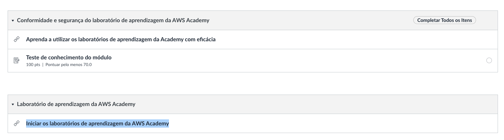
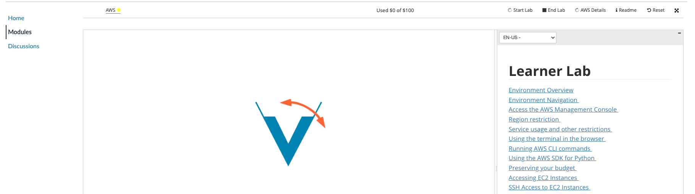
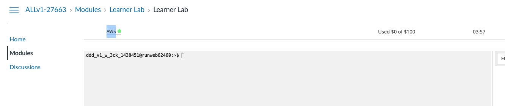
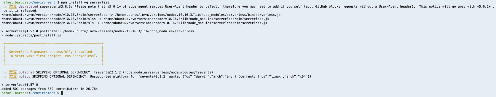
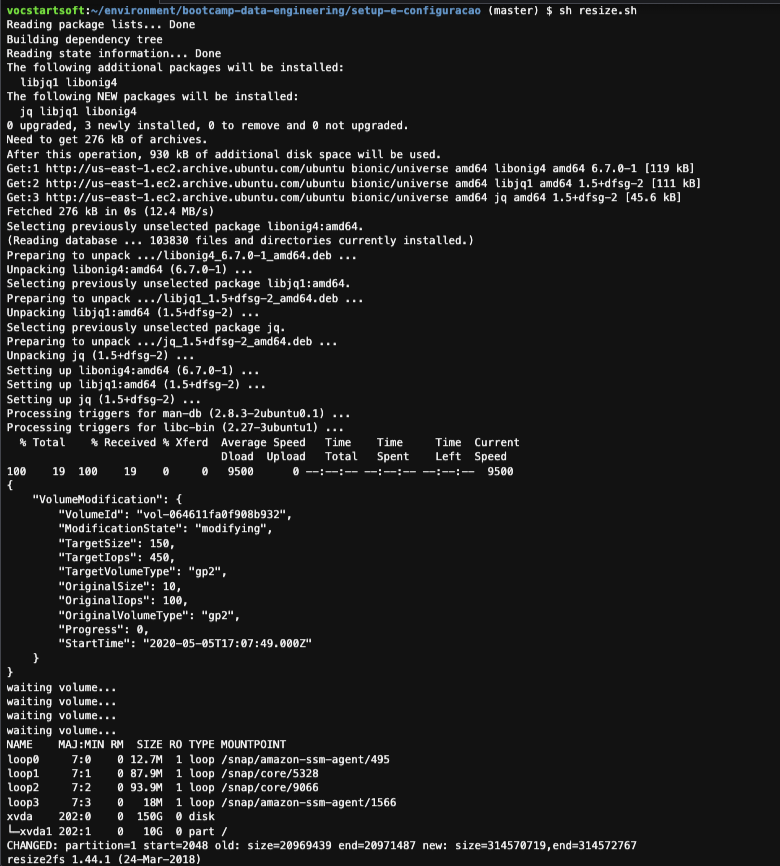

# 00 - Setup e Configuração de ambiente

Você irá utilizar 2 ferramentas para desenvolver os laboratorios:

1. Conta AWS através da AWS Academy. Conta provisionada para você utilizar durante essa disciplina com 100 dólares de crédito.

2. Cloud 9 IDE. Uma IDE cloud dentro da AWS para todos terem um ambiente igual e com a autorização para executar os comandos dos exercicios.

### Conta AWS - Academy

1. Caso não tenha conta no AWS Academy ainda:
   1. Entre no seu email da FIAP pelo endereço [webmail.fiap.com.br], caso não tenha utilizado um pessoal(http://webmail.fiap.com.br/)
   2. Seu email é no seguinte formato rm + numero do seu RM + @fiap.com.br. Caso seu RM seja por exemplo 12345 seu email seria rm12345@fiap.com.br. A senha é a mesma de portais.
   3. Você terá um email na caixa de entrada para convite do Academy, siga as instruções.
   4. Ao conseguir entrar na plataforma do academy, aparecerá uma turma que começa com `AWS Academy Learner Lab`. Apenas clique em `Enroll` para aceitar e acessar.
2. Para entrar na conta do Academy que já existe, acesse o link:  [awsacademy.com/LMS_Login](https://www.awsacademy.com/LMS_Login). Ao conseguir entrar na plataforma do academy, aparecerá uma turma que começa com AWS Academy Learner Lab. Apenas clique em Enroll para aceitar e acessar.
3. Dentro da plataforma clique em `cursos` na lateral esquerda e clique no curso da disciplina atual.

4. Dentro do curso clique em `Modules` na lateral esquerda

   

5. Clique em `Lerner Lab`

   

6. Se for seu primeiro acesso irá aparecer o contrato de termos e condições para aceitar. Role até o final para aceitar após a leitura do mesmo. Caso já tenha feito isso antes. Pule para o passo 7.
   
7. Essa é a tela para acessar sua conta AWS. Cada sessão terá 4 horas. Após esse tempo você terá que começar outra sessão, mas os dados gravados dentro da conta AWS ficam salvos até o final do curso ou entrega do trabalho final da disciplina. Clique em `Start Lab` para iniciar uma sessão. Esse processo pode demorar alguns minutos.
   
   
8. Quando tudo estiver pronto a bolinha ao lado do escrito `AWS` no superior esquerdo da tela ficará verde como na imagem abaixo. Apenas clique em `AWS` para abrir a conta aws em outra aba do navegador.

### Cloud 9

 1. Abra o console da AWS e va para o serviço `Cloud 9`.
   
3. garanta que a região que esta utilizando é `us-east-1/ Norte da Virgínia`. Você consegue ver isso no canto superior direiro da tela.
    
 2. Clique em `create environment`.
 3. Coloque o nome `lab-fiap` e avance.
 
 5. Deixe as configurações como na imagem a seguir. Se atente ao tipo da maquina que deve ser t2.medium:

 6. Caso os parametros estejam como na imagem a seguir clique em `Create Environment`
   
 7. A criação do ambiente pode levar alguns minutos.

 8. Após a criação clique em `abrir IDE`, caso o IDE não tenha aberto automaticamente.
   
9. Para os próximos comandos utilize o console bash que fica no canto inferior do seu IDE.
   
10. Execute o comando `npm install -g serverless` para instalar o serverless framework.
    
11. Execute o comando `sudo apt  install jq -y` para instalar o software que irá nos ajudar a ler e manipular Jsons no terminal
12. Execute o comando `npm install -g c9` para baixar a extenãp que ajudará o Cloud9 a lidar melhor com o como abrir arquivos no IDE.
13. Execute o comando `git clone https://github.com/vamperst/fiap-containers-e-orquestracao.git` para clonar o repositório com os exercicios.
14. Execute o comando `cd fiap-containers-e-orquestracao/` para entrar na pasta criada pelo git
15. Execute o comando `cd 00-Setup-e-configuracao` para entrar na pasta com os scripts de Configuração.
16. Precisamos aumentar o tamanho do volume(HD) do cloud9. Para isso execute o comando  `sh resize.sh`
   
16. Para facilitar a criação e updates manualmente das stacks do cloudformation vamos utilizar o plugin 'cfn-create-or-update'. Para instalr utilize o comando `npm install -g cfn-create-or-update`
17. Para instalar o docker execute o comando `curl -sSL https://get.docker.com/ | sudo sh`
18. O docker daemon precisa de permissão para aceitar comandos do usuario padrão. O comando `sudo usermod -aG docker ubuntu` adiciona o usuário principal da mauqina a utilizar o Docker.
19. Em outra aba do AWS Academy onde acessa a conta da AWS e no canto superior direito clique em 'AWS Details' e clique em 'show' nos campos de SSH Key.

23. Copie o conteudo da chave privada para a area de transferência(Ctrl+C).
    
24. Execute o comando `c9 open ~/.ssh/vockey.pem` para criar o arquivo que utilizaremos como chave para entrar nas instancias. 
25. Cole o conteudo da chave privada copiado nos passos anteriores e cole no ide no aquivo vockey.pem e salve utilizando "ctrl+S".
26.  Execute o comando `chmod 400 ~/.ssh/vockey.pem` para que a chave tenha a permissão correta.
27. Execute o comando a seguir para instalar o terraform `sh installTerraform.sh`
28. É necessário abrir as portas da maquina para as expêriencias em docker, para isso acesse o painel da [EC2](https://us-east-1.console.aws.amazon.com/ec2/home?region=us-east-1#Instances:tag:Name=:aws-cloud9;instanceState=running;v=3;$case=tags:true%5C,client:false;$regex=tags:false%5C,client:false) e selecione a instancia do Cloud9.

29. Na parte infeiror da tela clique na aba segurança e clique no link do Grupos de Segurança

30. Na parte inferior direita clique em `Editar regras de entrada`

31. Adicione uma regra com a descrição abaixo e clique em `Salvar regras`:
    1.  Tipo: `Todo o tráfego`
    2.  Origem: `Qualquer local-IPv4`

