## Conteiners 1.1 - Helloworld

1. No terminal do Cloud9 récem criado digite `docker run hello-world`
   
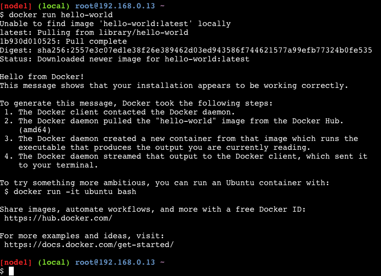

2. Suba um container ubuntu em entre nele na maneira interativa com o comando `docker run -ti ubuntu bash`. A opções "-ti" são as responsáveis por após a criação do container fazer o acesso a ele através do terminal.

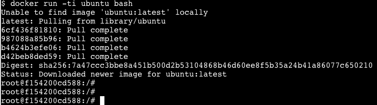

3. Para sair do modo interativo do container utilize o combinação de teclas `ctrl + P + Q`
4. Para verificar que o container que o container ainda esta ligado utilize o comando `docker ps`
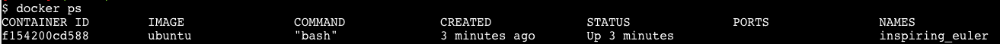
5. Note que o nome do container foi escolhido de maneira aleatória, para que isso não aconteça utilize o comando `docker run -ti --name ubuntu-teste ubuntu bash`.
6.  Saia do container com `ctrl + P + Q`
7.  Outra maneira de ver os containers em execução é o comando  `docker container ls`

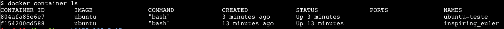

8. Utilize o comando `docker container ls -a` para ver todos os containers ativos e inativos do host

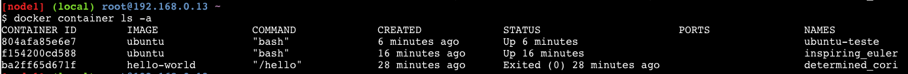

9. Utilize o comando `docker image ls` para ver todos as imagens do host

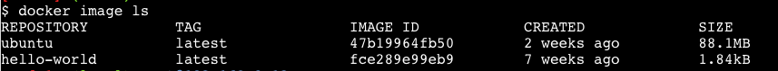

10. Agora que temos 2 containers iguais rodando, vamos parar e eliminar um deles com os seguintes comandos `docker container stop ubuntu-teste` e `docker container rm ubuntu-teste`

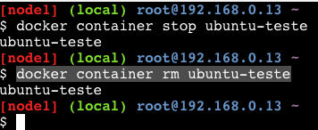

11. Agora com o comando `docker container ls -a` podemos ver que temos apenas 2 containers na maquina. Um ativo e um inativo.
12. Agora você vai forçar a remoção de um container em uso, para isso utilize o comando `docker container rm -f {nome do container ubuntu rodando}`. Para pegar o nome do container utilize o comando `docker container ls` e copie o nome do container que tem imagem ubuntu.

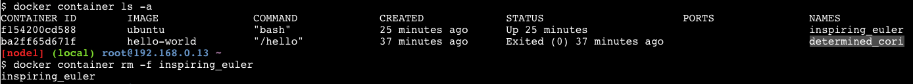

13.  Agora temos apenas um container no host `docker container ls -a`

14.  Delete o container que sobrou com o comando `docker container rm -f {nome do container restante}`.
15.  Delete a imagem do ubuntu do seu host com o comando `docker image rm {image_id}`, para conseguir o image_id rode o comando `docker image ls`

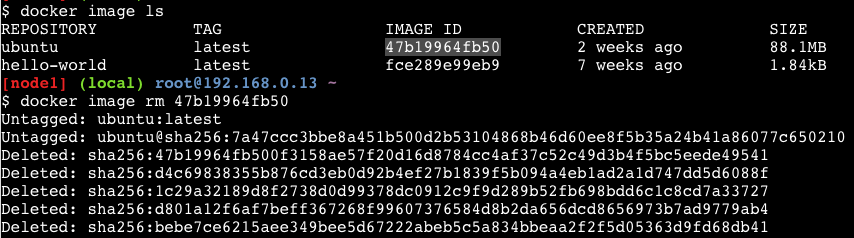

16. Execute o mesmo procedimendo para a imagem do hello-world

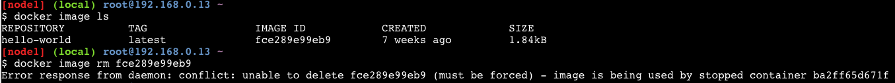

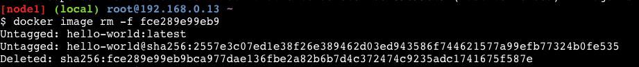

17.  Para limpar o restante do host execute o comando `docker system prune -a`

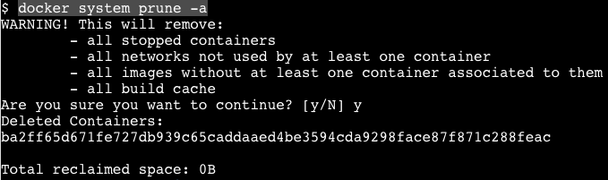
