## Conteiners 1.2 - Dockerfile

1. Dentro do Cloud 9 execute o comando `cd ~/environment`
1. Para bauxar o repositório da demor execute o comando `git clone https://github.com/vamperst/pyhton-app-docker-test.git`

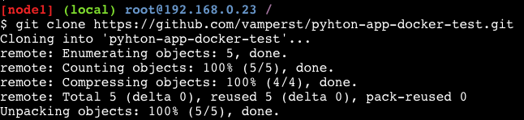

3. Entre na pasta pyhton-app-docker-test com o comando `cd pyhton-app-docker-test`
4. Para visualizar o Dockerfile utilize o comando `c9 open Dockerfile`
5. Faça o build da primeira imagem docker com o seguinte comando no terminal `docker build -t test/python-app:0.1 .`
6. Inicie um container com a imagem que acabou de criar: `docker run -d -p 5000:5000 --name python-app-0 test/python-app:0.1` 

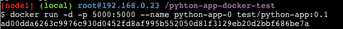

7. Antes de seguir, é necessário que libere as portas da maquina do Cloud 9 que esta utilizando. Para isso abra o [console do EC2](https://us-east-1.console.aws.amazon.com/ec2/home?region=us-east-1#Instances:instanceState=running) na AWS e clique na instancia que esta utilizando.
8. Clique na aba "Segurança" e depois no link com o nome do grupo de segurança.
    
    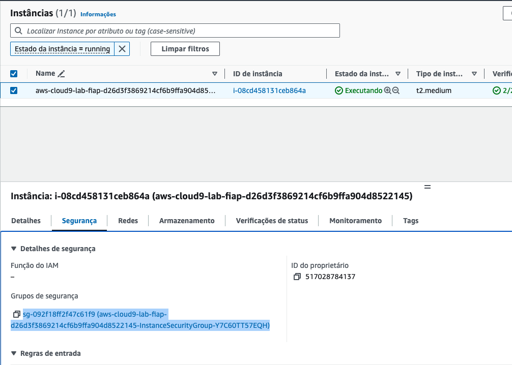

9. Clique na aba "Regras de entrada" e depois no botão "Editar Regras de Entrada"
    
    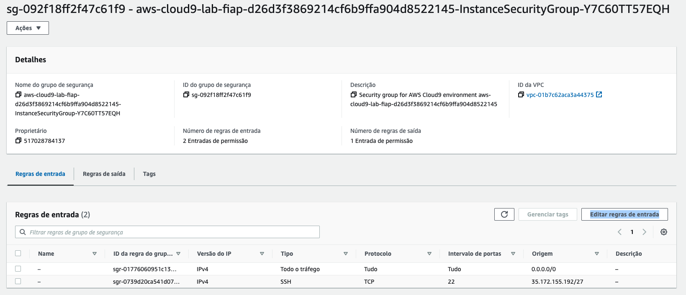

10. Clique em "Adicionar Regra" e adicione uma regra para liberar todas as portas de entrada. Para isso  selecione em Tipo "Todo o tráfego" e em origem "Qualquer local-IPV4". Clique em "Salvar Regras"

    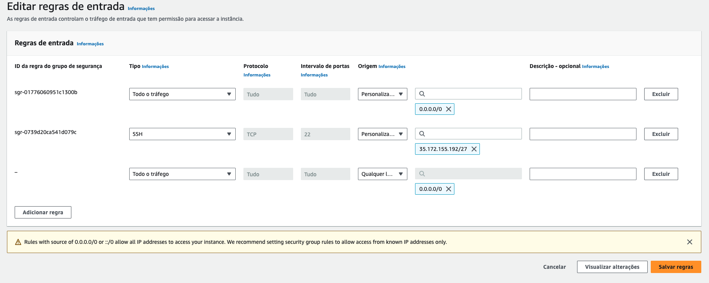

11. Devolta ao cloud9, utize o comando `ip=$(curl -s http://169.254.169.254/latest/meta-data/public-ipv4) && echo "" && echo "$ip:5000"` para pegar o IP da maquina do cloud9 já com a porta que acabou de utilizar para subir o container.

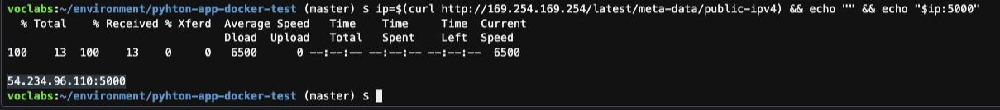

12.  Acesse o link com IP:Porta no navegador.
13. O 'Internal server error' já era esperado, se visualizar o arquivo app.py com o comando `c9 open app.py` vai notar que para funcionar o script precisar uma uma variável de ambiente chamada "number" na linha 8.

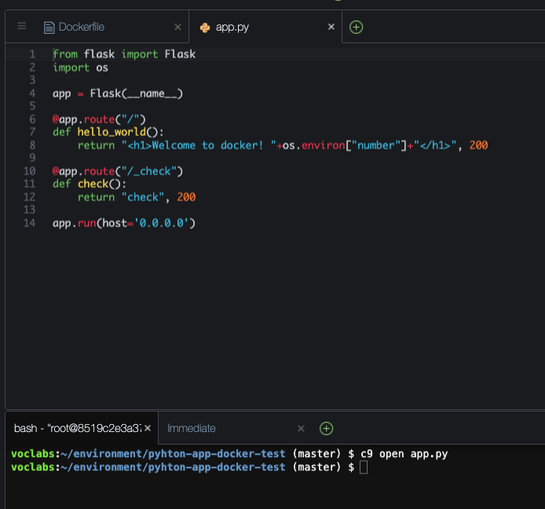

14. Remova o container criado com os comandos `docker container stop python-app-0` seguido de `docker container rm python-app-0`
15. Vamos subir um container agora com a variavel necessária utilizando o comando `docker run -d -p 5000:5000 --name python-app-0 -e number=0 test/python-app:0.1`
16. Acesse no navegador o ip da maquina na porta 5000, e veja se o script funcionou.


17.  Vamos subir vários containers cada um com sua variável de ambiente, porta, e nome especifico. Para tal utilize o script containerUp.sh com o comando `sh containerUp.sh`

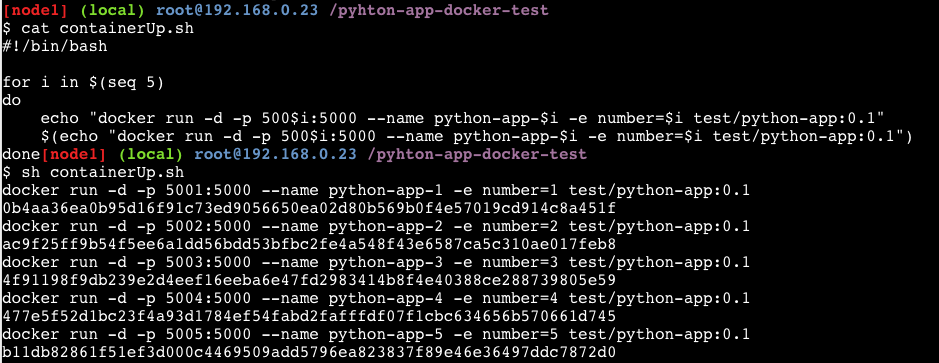

18. Teste os containers pelo links que o comando abaixo retornam. Copie e cole no navegador:
``` shell
for i in $(seq 5)
do
    ip=$(curl -s http://169.254.169.254/latest/meta-data/public-ipv4) && echo "" && echo "link:>>  $ip:500$i"
done
```
19. Desça todos os containers com o script containerDown.sh utilizando o comando `sh containerDown.sh`. Não se esqueça de eliminar o container 0 com o comando `docker container rm -f python-app-0`
20. Agora podemos ver o tamanho que as imagens ficaram com o comando `docker image ls`

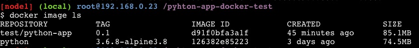

21. Note que a test/python-app:0.1 tem apenas 86 Mb na sua ultima layer, já que a imagem base python tem 74.5 Mb. Vamos diminuir isso para que os containers fiquem mais faceis de escalar.
22. Mude a branch do projeto para volume com o seguinte comando `git fetch && git checkout volume`

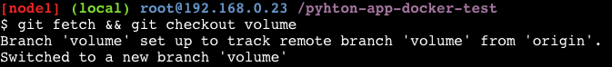

23. Note que houveram alterações importantes nos arquivos "app.py", "Dockerfile", e ".dockerignore"
O arquivo "app.py" agora aponta para '/dependencies' para procurar as dependecias do projeto;

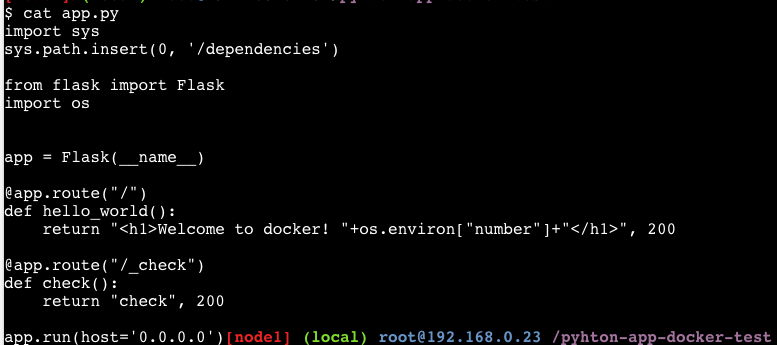

O Dockerfile não precisa mais fazer a instalação das dependencias;

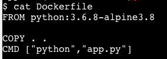

E por fim, foi adicionado a linha de ignorar o requirements.txt ao fazer o build da imagem

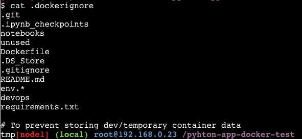

24. Faça o build da nova imagem com a tag 0.2 utilizando o seguinte comando `docker build -t test/python-app:0.2 .`

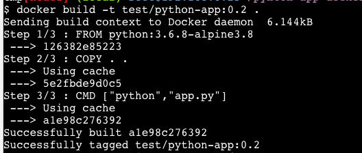

25. Agora vamos criar o volume onde ficarão as dependencias, para isso utilize o comando `docker volume create --name=dependencies01`
26. Copie o arquivo de dependencias do projeto para dentro do volume com o comando `sudo cp requirements.txt /var/lib/docker/volumes/dependencies01/_data/`
27. Para carregar as dependencias necessárias para o volume execute um container python passando o entrypoint no run `docker run -ti -v dependencies01:/dependencies python:3.10 /bin/bash -c "pip3 install -r /dependencies/requirements.txt -t /dependencies"`

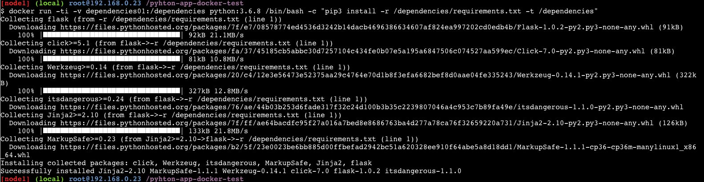
28.  Confirme que todas as dependecias estão no volume conforme desejado com o comando `sudo ls /var/lib/docker/volumes/dependencies01/_data/`

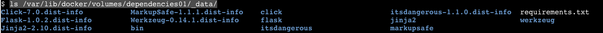

29. Suba o primeiro container apontando para o volume de dependecias com o comando `docker run -d -p 5000:5000 -v dependencies01:/dependencies --name python-app-0 -e number=0 test/python-app:0.2`
30. Teste através do link do comando `ip=$(curl -s http://169.254.169.254/latest/meta-data/public-ipv4) && echo "" && echo "$ip:5000"`
31. Agora que tudo esta certo, vamos subir 5 containers apontando para o volume com o comando `sh containerUp.sh`
32. Teste os containers criados

``` shell
for i in $(seq 5)
do
    ip=$(curl -s http://169.254.169.254/latest/meta-data/public-ipv4) && echo "" && echo "link:>>  $ip:500$i"
done
```

33. Veja a diferença do tamanho do container que aponta para um volume e um com todas as dependecias dentro utilizando com o comando `docker image ls`

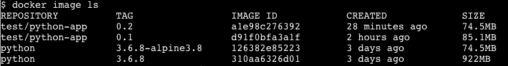

34. Outra maneira de testar os containers seria uma chamada local dos ips dos containers, para isso descubra o ip dos containers com o comando `docker inspect python-app-0 | jq`

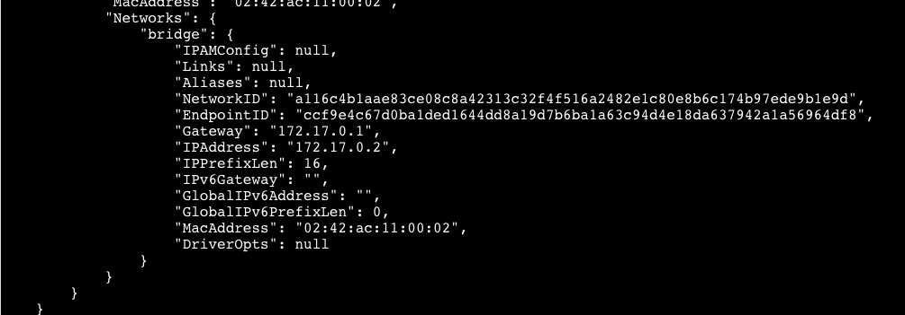

35. Para fazer curl em todos os containers use o script curlbycontainer.sh que ira usar o path _check(Health check ). Para fitrar o json o scrit usa jq. Execute o comando `sh curlbycontainer.sh`

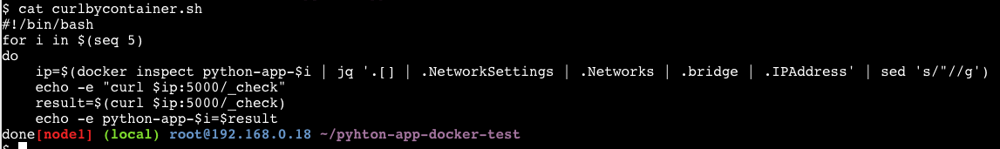

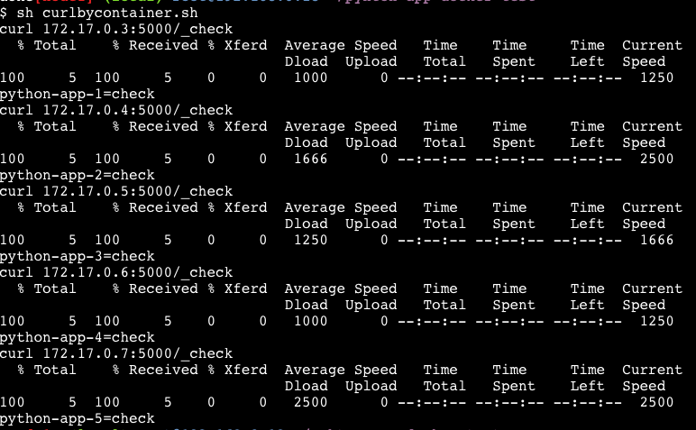

36.  Para deletar todos os containers utilize o script containerDown.sh com o comando `sh containerDown.sh`. Não se esqueça de eliminar o container 0 com o comando `docker container rm -f python-app-0`
