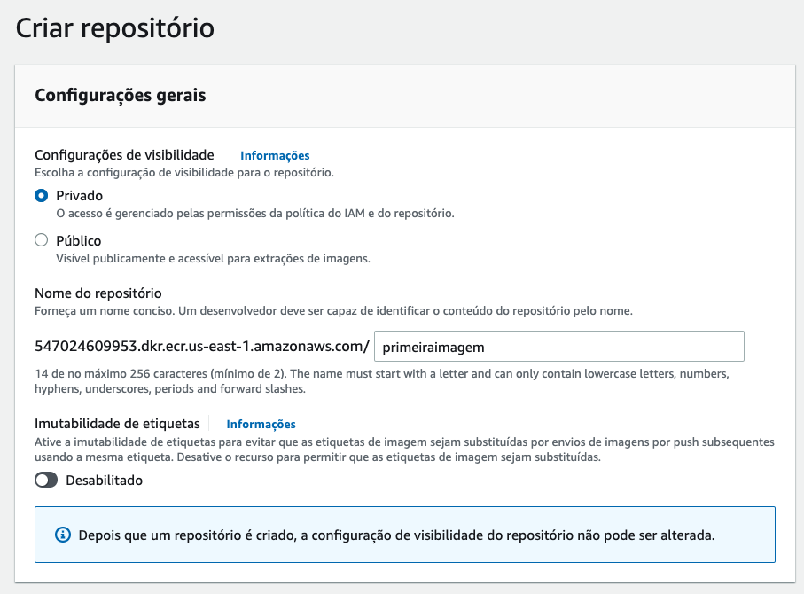
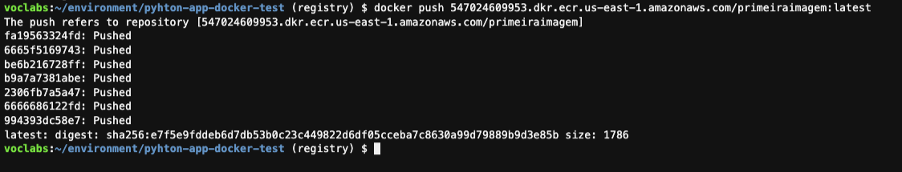
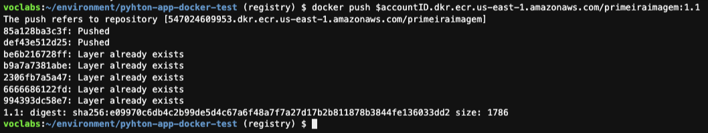

## Conteiners 1.3 - Registry

1. No cloud9 execute o comando `cd  ~/environment && git clone https://github.com/vamperst/pyhton-app-docker-test.git`, e após entre na pasta criada com o comando `cd pyhton-app-docker-test/`

3. Mude de branch do repositório com o sequinte comando `git fetch && git checkout registry`
   

4. Nos próximos passos vamos criar um repositório no ECR para sua imagem. Para tal abra o [link](https://us-east-1.console.aws.amazon.com/ecr/get-started?region=us-east-1) no seu navegador.
5. Clique em `Comece a usar` no canto direito superior da tela.


7. De o nome de `primeiraimagem` para o repositório e deixa as demais opções como estão. No final da página clique em `Criar repositório`



8. Quando o repositório é criado a tela fica como a imagem abaixo. Clique em `Visualizar comando push` do canto superior direito.


9. Siga a sequancia de comandos apresentados na tela do ECR em seu Cloud9 para fazer o login no registry do ECR récem criado, fazer o build da imagem segundo o Dockerfile, colocar a devida tag e push para o registry.
    
    

    

    

    

    

10. Apague todas as imagens com o comando `docker system prune -a` e confirme pressionando `y` quando pedido.
    
    

11. Se rodar o comando `docker image ls -a` verá que não tem nenhuma imagem guardada localmente.


12. Para baixar e executar a imagem novamente é necessário que pegue a URL do repositório no ECR. Para isso clique no [link] e copie o link conforme destacado na imagem abaixo.
    
    

13. Baixe e execute a imagem que colocou no docker hub com o comando `docker run --name primeiro  -d -p 5000:5000 LINK COPIADO:latest`. Note que apenas a ultima layer foi baixada porque a imagem base necessària já esta no host usado. Isso diminui muito o quanto o docker tem que baixar a cada atualização.
   
    

14. Para verificar que o container esta executando utilize o comando `docker container ls`
    


15. Execute o comando `ip=`curl -s <http://169.254.169.254/latest/meta-data/public-ipv4>`&& echo http://$ip:5000` para gerar o link para acessar o serviço recem criado via docker.
    


16. Acesse no navegador o link gerado no passo anterior.
    


17. Pare e elimine o container que acabou de criar com os comandos abaixo.
``` shell
docker container stop primeiro
docker container rm primeiro
```
    


18.  Para alterar o conteudo do que é exibido no navegador quando executa um container da imagem criada utilize o comando `sed -i -e 's/!!!!/!1.1/g' app.py`
    
19. Execute os comando abaixo para criar uma nova imagem e fazer o push para o repositório no ECR. Copie e execute uma linha por vêz.

``` shell
accountID=`aws sts get-caller-identity | jq .Account -r`
aws ecr get-login-password --region us-east-1 | docker login --username AWS --password-stdin $accountID.dkr.ecr.us-east-1.amazonaws.com

docker build -t primeiraimagem:1.1 .

docker tag primeiraimagem:1.1 $accountID.dkr.ecr.us-east-1.amazonaws.com/primeiraimagem:1.1

docker push $accountID.dkr.ecr.us-east-1.amazonaws.com/primeiraimagem:1.1

```



20. Olhe no ECR as novas tags existentes. Abra o [link](https://us-east-1.console.aws.amazon.com/ecr/repositories?region=us-east-1) no navegador e clique em `primeiraimagem`
    
    

21.  Remova todas as imagens com o padrão primeiraimagem com o comando `docker images -a | grep "primeiraimagem"| awk '{print $3}' | xargs docker image rm -f`
22. Vamos agora executar um container da nova imagem utilize o comando `docker run -d --name primeira -p 5000:5000 $accountID.dkr.ecr.us-east-1.amazonaws.com/primeiraimagem:1.1`. 

23. Teste no navegador para se certificar que funcionou
    
20. Pare e remova o container recem criado conforme os comandos vistos anteriormente na demo. O nome do container é `primeira`

