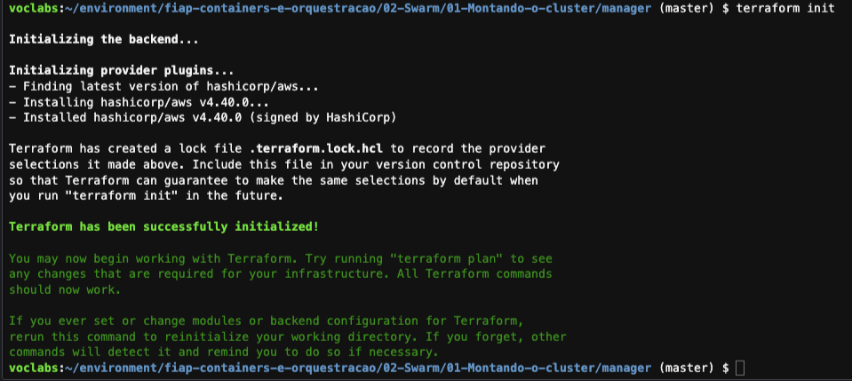
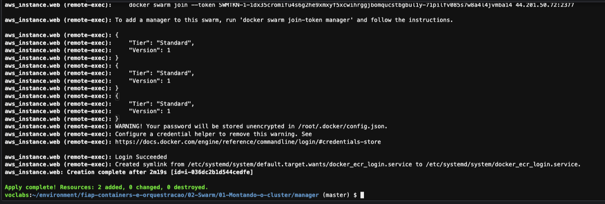

## Swarm 2.1 - Montando seu cluster

1. Entre na pasta das demos da disciplina com o comando `cd ~/environment/fiap-containers-e-orquestracao/` e atualize o repositório com o comando `git reset --hard && git pull origin master`
2. Primeiramente você irá precisar entrar na pasta onde está o código responsável por criar o nó master do cluster. Para isso execute o comando `cd ~/environment/fiap-containers-e-orquestracao/02-Swarm/01-Montando-o-cluster/manager/`
3. Antes de iniciar , você precisa adicionar ao cloud9 a chave SSH a ser utilizada para criar as maquinas na AWS. Para isso volte na aba do seu navegador `Worksbench - Vocareum`, a mesma que utiliza para abrir a conta da AWS quando fica verde, e clique em `AWS Details` no canto superior direito.
   
4. Em <b>SSH Key</b> clique em `Show` para visualizar a chave SSH que você irá utilizar para criar as maquinas na AWS.
   
   

   
5. Copie todo o conteúdo da chave SSH e volte para a aba do cloud9.
6. De volta ao cloud9, execute o comando `c9 open /home/ubuntu/.ssh/vockey.pem`. Esse comando vai abrir uma nova aba no seu IDE.
7. Cole o conteudo da chave SSH que você copiou anteriormente e salve o arquivo utilizando ctrl + S.
   
   

8. A aplicação que irá provisionar o cluster se chama [terraform](https://www.terraform.io/) e para inicializar ela execute o comando `terraform init`
   
9.  Agora para provisionar o nó master execute o comando `terraform apply --auto-approve`. Esse comando pode demorar por volta de 5 minutos para terminar.

1. Com o nó master de pé agora é hora de provisionar o worker para isso entre na pasta com o comando `cd ~/environment/fiap-containers-e-orquestracao/02-Swarm/01-Montando-o-cluster/workers/`.
2. Execute o comando `terraform init` para inicializar o terraform dos workers.
   
3. Para provisionar o nó worker do cluster swarm utilize o comando `terraform apply --auto-approve`. Esse comando pode demorar por volta de 5 minutos para terminar.
   
