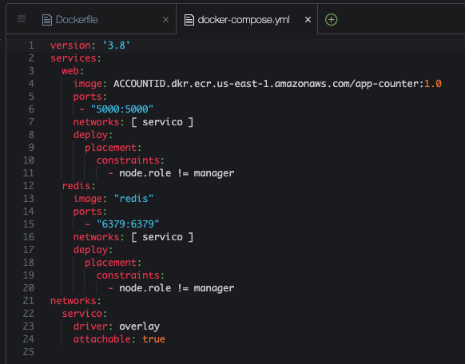

## Conteiners 2.2 - Compose & Swarm Intro

1. Volte a raiz do seu cloud9 com o comando `cd ~/environment`
2.  Baixe o repositório a ser utilizado nessa demo com o comando `git clone https://github.com/vamperst/python-redis-docker-compose-intro.git`

2. Entre na pasta 'python-redis-docker-compose-intro' com o comando `cd ~/environment/python-redis-docker-compose-intro`
3. Execute o comando `cat Dockerfile` para ver o conteudo do Dockerfile
   
4. Execute o comando `cat docker-compose.yml` para ver o conteudo do docker-compose.yml
   
5. Esta aplicação consiste em um app que conta quantos acessos uma pagina já teve e exibe a cada acesso. Para tal utiliza um código python que esta na pasta lib, e um container de redis como banco de dados.
6. Primeiro vamos criar a imagem do aplicativo que temos Dockerfile e colocar no dockerhub. Utilize o exemplo dos exercicios anteriores caso necessário. Utilize o nome 'app-counter' na imagem.
7. Você irá precisar do numero da sua conta em uma variável do console. Para isso execute o comando 
    ``` shell
    accountID=`aws sts get-caller-identity | jq .Account -r`  
    ```
8. Execute o comando `sed -i -e "s/ACCOUNTID/$accountID/g" docker-compose.yml` para atualizar o arquivo para utilizar seu account id no nome da imagem. Você pode verificar a diferença pelo comando `cat docker-compose.yml`
9. Será necessário criar um novo repositório do ECR para fazer o push da imagem dessa demo. Para isso acesse o [link](https://us-east-1.console.aws.amazon.com/ecr/create-repository?region=us-east-1)
10. O repositório deve se chamar `app-counter`
    
11. Clique em `Criar repositório`
12. Devolta ao terminal do Cloud9 execute a sequência abaixo de comandos UM POR UM para que você monte a imagem docker e faça o push para o repositório récem criado.
    ``` shel
    accountID=`aws sts get-caller-identity | jq .Account -r`
    aws ecr get-login-password --region us-east-1 | docker login --username AWS --password-stdin $accountID.dkr.ecr.us-east-1.amazonaws.com
    docker build -t app-counter .
    docker tag app-counter:latest $accountID.dkr.ecr.us-east-1.amazonaws.com/app-counter:1.0
    docker push $accountID.dkr.ecr.us-east-1.amazonaws.com/app-counter:1.0
    ```
13. Antes de criar o deploy da aplicação você deve garantir que o terminal utilizado esta logado no ECR com os comandos e que maquina do Cloud9 esta como manager do cluster:
    ``` shell
    publicIp=`aws ssm get-parameter --name "docker-join-manager-ip" | jq .Parameter.Value -r` 
    token=`aws ssm get-parameter --name "docker-join-manager-token" | jq .Parameter.Value -r` 
    docker swarm join --token  $token $publicIp:2377
    accountID=`aws sts get-caller-identity | jq .Account -r`
    aws ecr get-login-password --region us-east-1 | docker login --username AWS --password-stdin $accountID.dkr.ecr.us-east-1.amazonaws.com
    ```
    
14. Execute o comando `docker stack deploy --with-registry-auth --compose-file docker-compose.yml app-counter` para subir todos os serviços
   
11. Execute o comando `docker stack ls` para ver o status da stack completa
    
12. Você também pode verificar a saude dos serviços através do comando `docker service ls`
    
13. Caso todos os serviços estejam rodando conforme a imagem acima é hora de acessar o serviço criado. Para isso você vai precisar acessar via o IP público do nó worker, utilize o comando abaixo para gerar o link.
    ```
    workerIp=`aws ssm get-parameter --name "docker-worker-ip" | jq .Parameter.Value -r` && echo "http://$workerIp:5000"
    ```
    
14. Ao acessar via navegador você pode recarregar a página e ver o contador aumentar por que a cada vez que acessa um registro no redis é atualizado.
    
15. De volta ao Coud9, para visualizar todos os containers em execução e onde estão vamos utilizar o Visualizer. Para tal execute o comando `docker service create --name=viz --publish=8080:8080/tcp  --constraint=node.role==manager --mount=type=bind,src=/var/run/docker.sock,dst=/var/run/docker.sock dockersamples/visualizer`
    
    
16. Utilize o comando abaixo para visualizar onde estão rodando cada container de serviço no cluster. Tente os 2 IPs pois o serviço irá rodar em qualquer um dos dois managers do cluster
    ```
    publicIp=`aws ssm get-parameter --name "docker-join-manager-ip" | jq .Parameter.Value -r` && echo "http://$publicIp:8080"
    publicC9Ip=`curl -s http://169.254.169.254/latest/meta-data/public-ipv4` && echo "http://$publicC9Ip:8080"
    ```
    
17. Voltando ao Cloud9, agora vamos remover tudo do cluster. Primeiro a stack, execute o comando `docker stack rm app-counter`. Vai conseguir notar no visualizer que logo após o comando, os containers sumiram rapidamente.
    
18. Por fim remova o serviço criado para o visualizer com o comando `docker service rm viz`