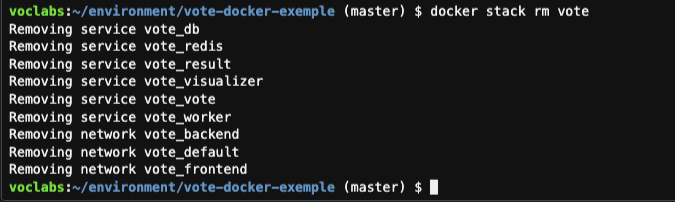

## Conteiners 2.3 - Volumes & Network

1. Execute o comando `cd ~/environment` para retornar a raiz do cloud 9
2. Faça o clone do resositório vote-docker-exemple com o comando `git clone https://github.com/vamperst/vote-docker-exemple.git && cd vote-docker-exemple`
3. Para subir a stack execute os comandos abaixo 
    ``` shell
    accountID=`aws sts get-caller-identity | jq .Account -r`
    aws ecr get-login-password --region us-east-1 | docker login --username AWS --password-stdin $accountID.dkr.ecr.us-east-1.amazonaws.com
    docker stack deploy --with-registry-auth --compose-file docker-compose.yaml vote
    ``` 
4. Note no visualizer que o container no visualizer ficou em um nó manager como esta na configuração.
    ```
    publicIp=`aws ssm get-parameter --name "docker-join-manager-ip" | jq .Parameter.Value -r` && echo "http://$publicIp:8080"
    publicC9Ip=`curl -s http://169.254.169.254/latest/meta-data/public-ipv4` && echo "http://$publicC9Ip:8080"
    ```
    
5. Teste o Serviço de votação. Para isso execute os comandos abaixo afim que pegar a URL de cada serviço. O contador de votos se encontra na porta 5001 e a página para votar esta na porta 5000.
   ```
   workerIp=`aws ssm get-parameter --name "docker-worker-ip" | jq .Parameter.Value -r` && echo "Contador de votos - http://$workerIp:5001"
   echo "Página de votação - http://$workerIp:5000"
   ```
   
   

   
6. Você deve ter notado que o sistema guarda apenas um voto, e cado mude seu voto, isso reflete na porcentagem da contagem (100% para a sua ultima opção), mas não reflete na quantidade. Para descobrir o que esta acontecendo vamos ver o log do banco que serve o aplicativo resultapp. Para tal execute o comando `docker service logs -f vote_db`. Note que cada vez que vota na mesma opção ocorre um erro. Para fechar o log do terminal utilize a combinação de teclas CTRL + C.
   
7. O erro acima ocorre porque a chave do banco utilizada na votação é o cookie do seu navegador. Logo para conseguir votar mais de uma vez é necessário abrir abas privativas no seu navegador, acessar a página de votação, executar o voto e fechar. Para abrir abas privativas utilize o atalho CTRL + Shift + N. Note que agora quando vota a porcentagem e a quantidade se alteram.
   
8.  Delete a stack com o comando `docker stack rm vote`
   
9.  Este exercício consumiu bastante espaço de disco nos nós em que foi feito o deploy. Vamos fazer o deploy de uma stack para executar o comando docker system prune em todos os nós do cluster. Para executar rode os comandos abaixo no cloud9.
    ```
    cd ~/environment/vote-docker-exemple/
    docker stack deploy --with-registry-auth --compose-file docker-compose-prune.yaml tasks
    ```
10. Aguarde um minuto e rode o comando abaixo para ver os logs executados em cada maquina do cluster.
    ```
    docker service logs tasks_system-prune
    ```
11. Afim de parar esse serviço execute o comando `docker stack rm tasks`
