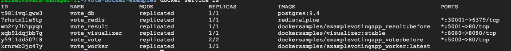
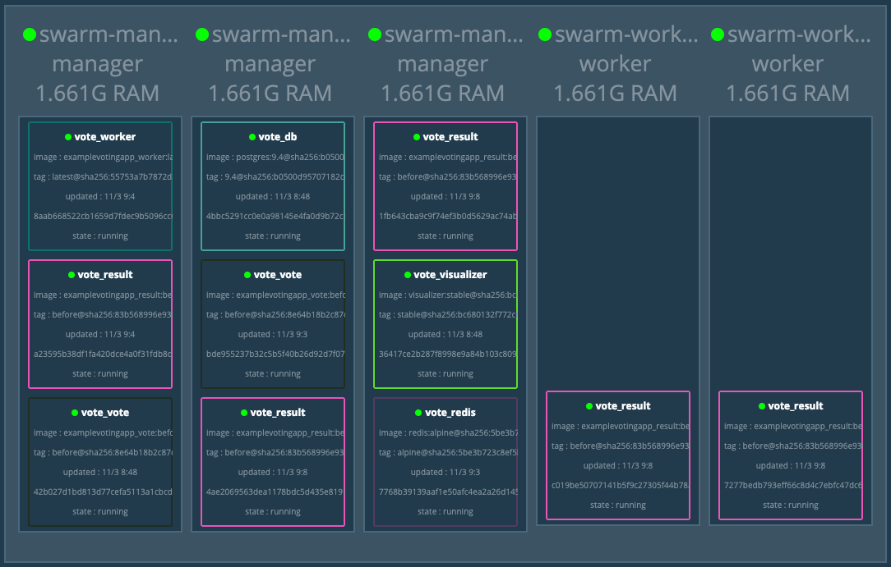
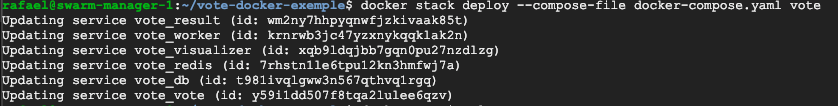
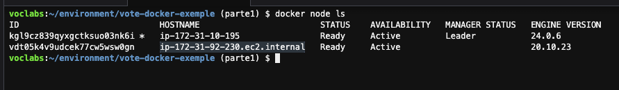
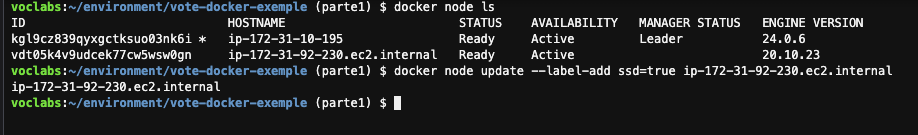
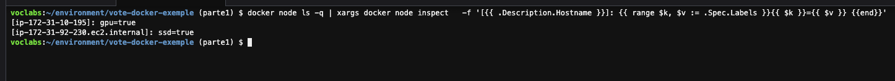
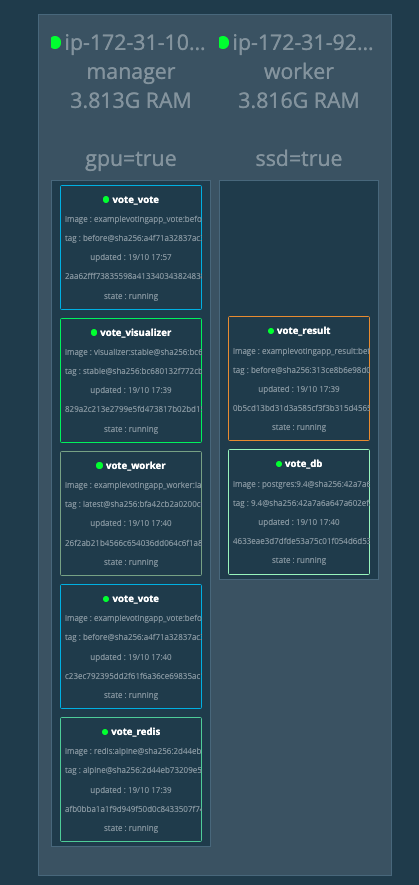
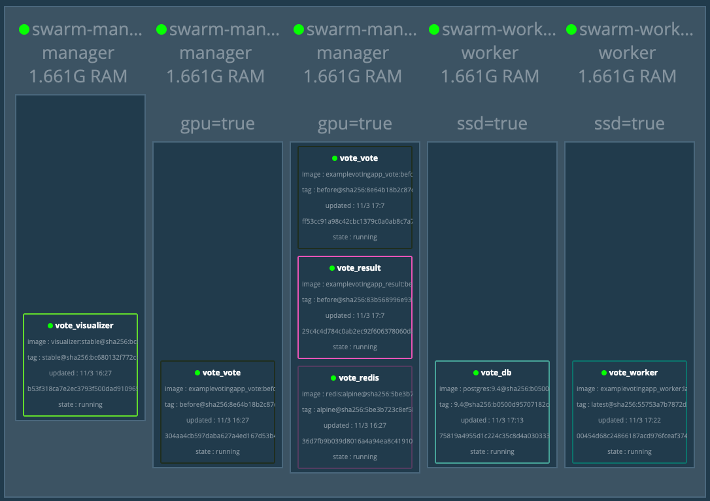

## Conteiners 2.4 - Scale Failover, Node Label
1. No seu cloud 9 execute o comando `cd ~/environment && git clone https://github.com/vamperst/vote-docker-exemple.git` para baixar o repositório do exercicio.
2. Entre na pasta do projeto com o comando `cd vote-docker-exemple`
3. Suba a stack com o comando `docker stack deploy --compose-file docker-compose.yaml vote`
4. Verifique se todos os serviços já estão em execução com o comando `docker service ls`
   
5. Abra uma aba no seu navegador para monitorar o visualizer
6. Vamos simular uma alta demanda do result-app tendo que escalar. Desligue os 2 workers.
7. Utilize o comando `docker service scale vote_result=20`
8. Vamos aumentar ainda mais o numero de containers do serviço com o comando `docker service scale vote_result=30`, note que o worker recebe todos os novos containers.
9.  Agora que pasosu o pico de acesso, rode `docker service scale vote_result=5`. O cluster volta a ficar equilibrado em numero de containers por nó.
    
10. Execute o comando `git fetch && git checkout parte1` para mudar de branch no projeto.
11. Note que o arquivo compose tem algumas mudanças, tem mais configurações.
12. Faça um deploy com o novo compose utilizando o comando `docker stack deploy --compose-file docker-compose.yaml vote`, os serviços vão ser todos atualizados porque já existem no cluster.
    
13. Agora vamos adicionar algumas labels aos hosts. Label de ssd (perfeito para bancos de dados), e GPU.
14. Execute o comando `docker node ls` e copie o HOSTNAME do nó que <b>não</b> é leader.
    
    

15. Execute o comando `docker node update --label-add ssd=true HOSTNAMECOPIADO` 
    
16. Execute o comando `docker node ls` e copie o HOSTNAME do nó que <b>é</b> leader.
17. Execute o comandos `docker node update --label-add gpu=true HOSTNAMECOPIADO`
18. Para ter certeza que os labels funcionaram execute o comando: 
``` shell
docker node ls -q | xargs docker node inspect \
  -f '[{{ .Description.Hostname }}]: {{ range $k, $v := .Spec.Labels }}{{ $k }}={{ $v }} {{end}}'
```



19.  Atualize seu compose para a versão onde as tags são utilizadas. Para tal execute o comando `git fetch && git checkout parte2`
20. Note que agora os serviços "vote" e "db" dependem de hosts com tags.
21. Execute o novo compose com o comando `docker stack deploy --compose-file docker-compose.yaml vote`
22. Note que assim que o primeiro worker ligou um container db foi colocado nele
        
23. Caso seu serviço "Worker" não retorne a normalidade é porque atingiu o maximo de tentativas configurada. Force o serviço com o comando `docker service scale vote_worker=1`
    
24. Execute o comando `docker service scale vote_vote=10`, note que o swarm não coloca o container em outras maquinas mesmo tendo espaço e processamento livre.
25. Execute o comando `docker service scale vote_vote=2`
26. remova a stack com o comando `docker stack rm vote`