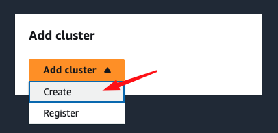
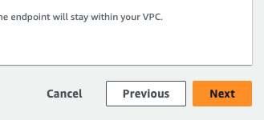
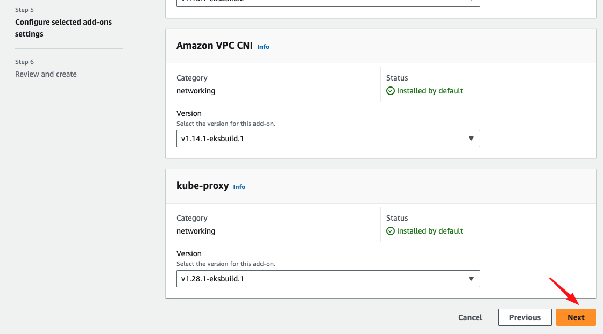
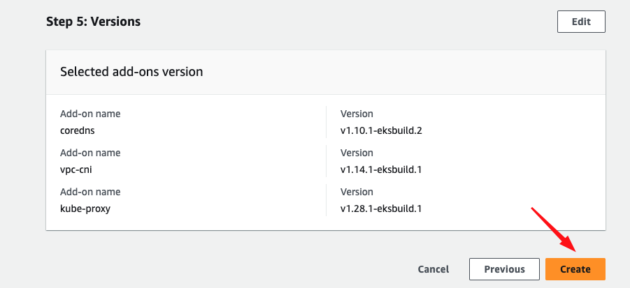
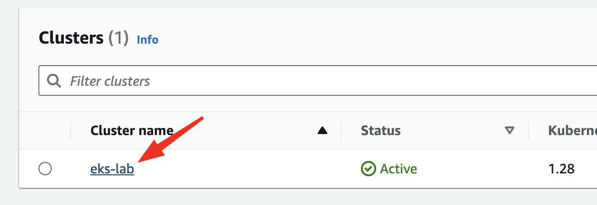
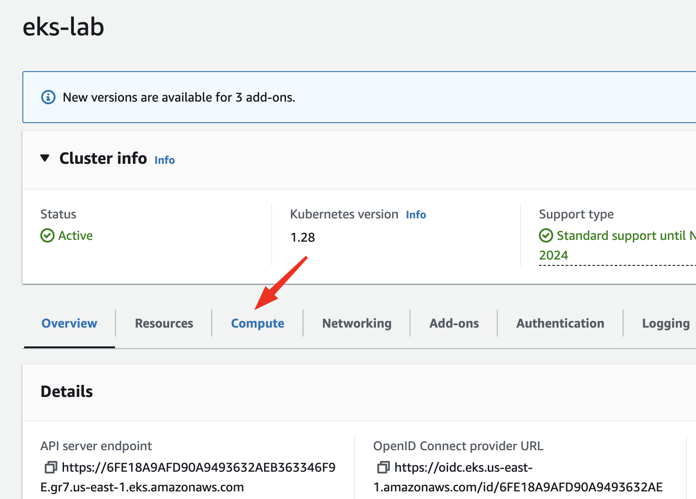
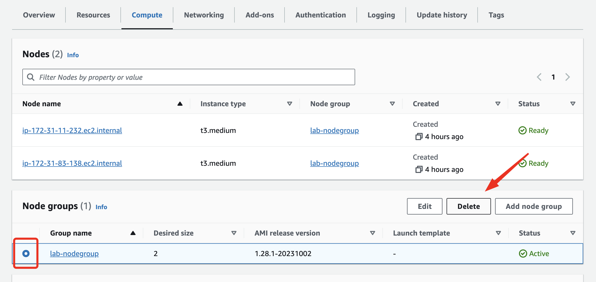
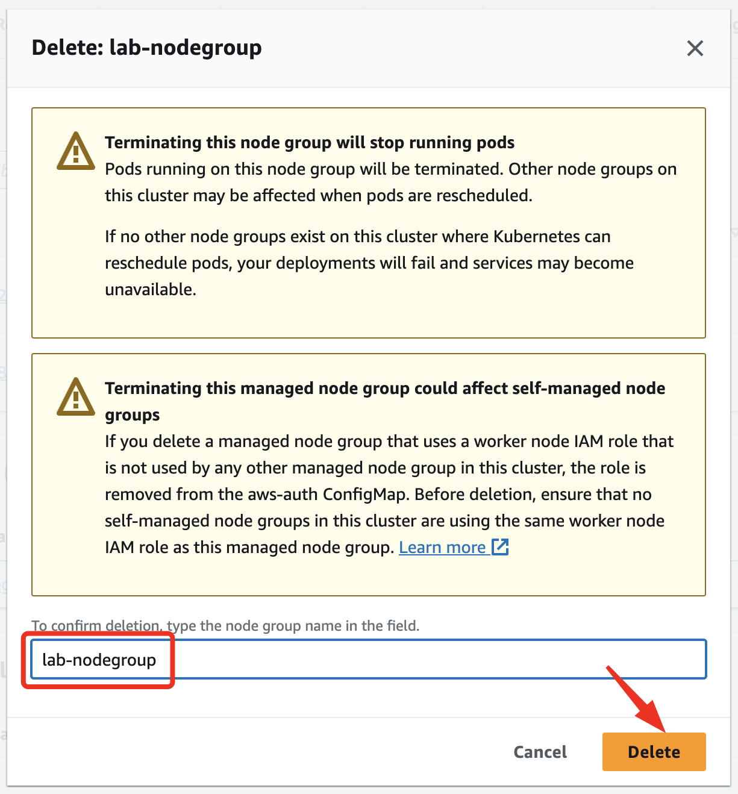
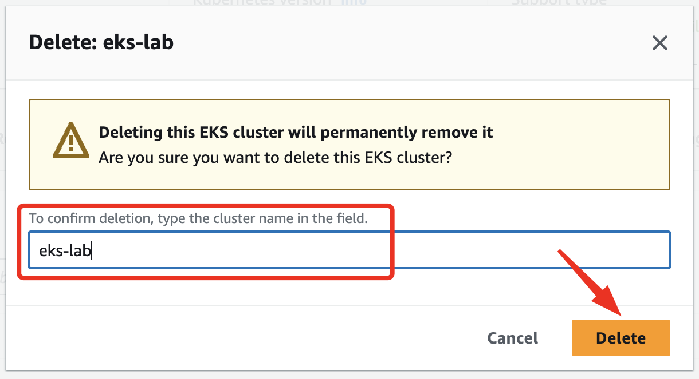

# Hands-On Kubernetes

Bem-vindos ao laboratório de hands-on de Kubernetes! Durante esta atividade, você irá aprender como criar um cluster Kubernetes utilizando o Elastic Kubernetes Service (EKS) e entender os principais componentes que formam um cluster Kubernetes.

Vamos abordar como criar o deploy de aplicação e quais são componentes necessários, além de escalar o ambiente, verificar os logs dos contêineres e acessar um Pod via SSH.

Ao final deste laboratório, você passará a entender os principais componentes do kubernetes, apto a criar e gerenciar seus próprios clusters Kubernetes na AWS, utilizando as melhores práticas para orquestração de contêineres. Vamos começar!


## O que é o EKS

O Amazon Elastic Kubernetes Service (EKS) é um serviço gerenciado de Kubernetes que simplifica o processo de implantação, operação e manutenção de clusters Kubernetes na Amazon Web Services (AWS).

O EKS fornece um ambiente Kubernetes totalmente gerenciado, que inclui:

Nós do Kubernetes gerenciados pela AWS
Controle de acesso e gerenciamento de identidade
Atualizações e patches do Kubernetes
Monitoramento e alertas
O EKS é uma boa opção para organizações que desejam implantar e gerenciar aplicativos Kubernetes na AWS sem precisar gerenciar a infraestrutura subjacente.

Aqui estão alguns dos benefícios do EKS:

Fácil de configurar e gerenciar: O EKS fornece um ambiente Kubernetes totalmente gerenciado, o que significa que você não precisa se preocupar com a instalação ou manutenção da infraestrutura subjacente.
Segurança: O EKS fornece recursos de segurança integrados, como controle de acesso e gerenciamento de identidade.
Escalabilidade: O EKS é escalável horizontalmente para atender às suas necessidades.
Compatibilidade: O EKS é compatível com o Kubernetes, o que significa que você pode usar as ferramentas e plugins de sua escolha.

Mas existem outras opções de clusters Kubernetes gerenciados em outras clouds publicas, como: Google: Google Kubernetes Engine (GKE) e Azure: Azure Kubernetes Service (AKS).

### Pré-requisitos:
Ter acesso a conta lab no AWS Academy https://awsacademy.instructure.com/.


## Provisionando o EKS

Acesse o console da aws e pesquise por EKS e clique em Elastic Kubernetes Service.\


Ao clicar na página do serviço clique em <b>Add cluster</b>.\


Depois clique em create.\


Ao clicar em create vamos preencher o nome do nosso cluster como `eks-lab` em <b>Nome</b>.\


Logo em seguida clique em Next.\


Em <b>Subnets</b> selecione as subnets `us-east-1a`, `us-east-1b` e `us-east-1c` e em <b>Security Groups</b> selecione o security group `default`.\


Clique em Next:\


Nas configurações de log, em <b>Control plane logging</b> habilite os logs do `API Server`, `Audit`, `Authenticator`, `Controller Manager` e `Scheduler` e depois clique em <b>Next</b>.\


Em <b>add-ons</b> deixe selecionado o `CoreDNS`, `Amazon VPC CNI` e `kube-proxy`, logo em seguida clique em <b>Next</b>.\


Clique em <b>Next</b>.\


Clique em <b>Next</b> novamente para confirmar a instalação das versões dos plugins.\


Aguarde a criação do cluster, demora em torno de 10 minutos.\


### Cloud Shell

Para gerenciar o nosso cluster, iremos utilizar o Cloud Shell serviço de Terminal Interativo da AWS.

Antes vamos entender o que é o Cloud Shell!

O AWS Cloud Shell é um ambiente de terminal interativo baseado no navegador que permite que você execute comandos e scripts da AWS CLI. Ele é pré-provisionado com as ferramentas e bibliotecas mais comuns que você precisa para trabalhar com a AWS, incluindo:

- Bash: O shell padrão do Linux
- Python: Uma linguagem de programação popular
- Node.js: Um ambiente de execução JavaScript
- Git: Um sistema de controle de versão

No concole da AWS, no canto inferior esquerdo, tem o ícone do Cloud Shell, clique nele!\


Ao clicar no ícone do CloudShell ele irá provisionar um console para você poder utilizar para gerenciar os serviços da aws através de CLI (Command Line Interface).\


> O CloudShell é como se fosse aqueles consoles que existe em data centers, para quem não conhece:


Agora que conhece o CloudShell e para que ele serve, iremos utilizar ele até o final desta aula.

Nosso cluster já foi provisionado e agora precisamos gerenciar ele, lembra que eu comentei sobre o API Server que o cliente (kubectl) se conecta a ele para poder gerenciar o cluster.

### Conhecendo o kubectl

O kubectl é uma ferramenta de linha de comando utilizada para interagir com clusters Kubernetes. Ele permite que os usuários gerenciem aplicativos e recursos em um cluster Kubernetes, como implantações, serviços, pods, configurações, etc.

Com o kubectl, é possível implantar e escalar aplicativos, fazer rolling updates e rollbacks, gerenciar o estado dos pods e serviços, criar e gerenciar objetos personalizados, além de muitas outras tarefas relacionadas ao gerenciamento de um cluster Kubernetes.

O kubectl é uma ferramenta essencial para qualquer pessoa que trabalhe com Kubernetes, como desenvolvedores, administradores de sistemas e operadores de cluster. Ele é usado em um ambiente de terminal para interagir com o cluster Kubernetes e executar operações em qualquer nó ou componente do cluster.

Em resumo, o kubectl é a principal ferramenta de gerenciamento de Kubernetes que permite que você controle e gerencie aplicativos em um cluster Kubernetes.

O <b>CloudShell</b> já vem com o `kubectl` então não precise se preoupar com a instalação, mas caso precise instalar, acesse a documentação: [clique aqui!](https://kubernetes.io/docs/tasks/tools/install-kubectl-linux/)


### Configurando o Kubectl
Agora iremos configurar o kubectl, execute o comando abaixo no <b>CloudShell</b>:

```bash
aws eks update-kubeconfig --region us-east-1 --name eks-lab
```

Verificando se os componentes do cluster está executando corretamente:

```
$ kubectl cluster-info

Kubernetes control plane is running at https://6FE18A9AFD90A9493632AEB363346F9E.gr7.us-east-1.eks.amazonaws.com
CoreDNS is running at https://6FE18A9AFD90A9493632AEB363346F9E.gr7.us-east-1.eks.amazonaws.com/api/v1/namespaces/kube-system/services/kube-dns:dns/proxy

To further debug and diagnose cluster problems, use 'kubectl cluster-info dump'.

```

Verificando se o Etcd, Scheduler e o Controller-Manager está funcionando corretamente.

```
$ kubectl get componentstatuses
NAME                 STATUS    MESSAGE   ERROR
etcd-0               Healthy   ok
controller-manager   Healthy   ok
scheduler            Healthy   ok
```

Listando os nós do cluster:

```
$ kubectl get nodes
No resources found
```

O que está faltando provisionar?

### Provisionando os Nodes Groups
Ops, faltou provisionarmos o nosso <b>Node Group</b>, para provisionar, em cluster EKS clique em <b>Compute</b> e logo na sequência clique em <b>Add node group</b>.\


Listando os componentes do cluster

```
$ kubectl get all --all-namespaces

NAMESPACE     NAME                          READY   STATUS    RESTARTS   AGE
kube-system   pod/aws-node-h4457            2/2     Running   0          174m
kube-system   pod/aws-node-qhdgm            2/2     Running   0          171m
kube-system   pod/coredns-58488c5db-6lbn2   1/1     Running   0          171m
kube-system   pod/coredns-58488c5db-v89qz   1/1     Running   0          172m
kube-system   pod/kube-proxy-x7sqh          1/1     Running   0          171m
kube-system   pod/kube-proxy-zwgdr          1/1     Running   0          174m

NAMESPACE     NAME                 TYPE        CLUSTER-IP    EXTERNAL-IP   PORT(S)         AGE
default       service/kubernetes   ClusterIP   10.100.0.1    <none>        443/TCP         9h
kube-system   service/kube-dns     ClusterIP   10.100.0.10   <none>        53/UDP,53/TCP   9h

NAMESPACE     NAME                        DESIRED   CURRENT   READY   UP-TO-DATE   AVAILABLE   NODE SELECTOR   AGE
kube-system   daemonset.apps/aws-node     2         2         2       2            2           <none>          9h
kube-system   daemonset.apps/kube-proxy   2         2         2       2            2           <none>          9h

NAMESPACE     NAME                      READY   UP-TO-DATE   AVAILABLE   AGE
kube-system   deployment.apps/coredns   2/2     2            2           9h

NAMESPACE     NAME                                DESIRED   CURRENT   READY   AGE
kube-system   replicaset.apps/coredns-58488c5db   2         2         2       9h
```

Listando os contextos dos clusters configurados:

```
kubectl config get-contexts
CURRENT   NAME                                                 CLUSTER                                              AUTHINFO                                             NAMESPACE
          arn:aws:eks:us-east-1:679551794714:cluster/abc       arn:aws:eks:us-east-1:679551794714:cluster/abc       arn:aws:eks:us-east-1:679551794714:cluster/abc
*         arn:aws:eks:us-east-1:679551794714:cluster/eks-lab   arn:aws:eks:us-east-1:679551794714:cluster/eks-lab   arn:aws:eks:us-east-1:679551794714:cluster/eks-lab
```

O kubectl pode ser usado para configurar o contexto de um cluster no arquivo ~/.kube/config. Esse arquivo é usado pelo kubectl para determinar qual cluster, usuário e namespace devem ser usados para interagir com o cluster.

A seguir estão os principais elementos de um contexto configurado no arquivo ~/.kube/config:

`apiVersion`: a versão da API do Kubernetes usada pelo arquivo de configuração.\
`kind`: o tipo do objeto Kubernetes. Para um contexto, o tipo é Context.\
`name`: o nome do contexto.\
`context`: um objeto que define as informações de contexto para um cluster, incluindo cluster, user e namespace.\
`cluster`: um objeto que define as informações do cluster, incluindo o nome do cluster e o endpoint para se conectar ao API server.\
`user`: um objeto que define as informações de autenticação do usuário, como o nome do usuário e a chave de acesso.\
`namespace`: o namespace padrão a ser usado pelo contexto.\

Um exemplo de contexto configurado no arquivo ~/.kube/config pode ser semelhante a este:

```
clusters:
- cluster:
    certificate-authority-data: LS0tLS1CRUdJTiBDRVJUSUZJQ0FURS0tLS0tCk1JSURCVENDQWUyZ0F3SUJBZ0lJWkxsMFErVjNVRGN3RFFZSktvWklodmNOQVFFTEJRQXdGVEVUTUJFR0ExVUUKQXhNS2EzVmlaWEp1WlhSbGN6QWVGdzB5TXpFeE1ERXdNRE...kwySmsyd2hKUUppUHRNQ1piUlNKS3hDM2tzWkEKUkV3VExGZG5nR1owCi0tLS0tRU5EIENFUlRJRklDQVRFLS0tLS0K
    server: https://SUASUGSHSUAYRSKDKSAUSA.gr7.us-east-1.eks.amazonaws.com
  name: arn:aws:eks:us-east-1:679551794714:cluster/eks-lab
- cluster:
    certificate-authority-data: LS0tLS1CRUdJTiBDRVJUSUZJQ0FURS0tLS0tCk1JSURCVENDQWUyZ0F3SUJBZ0lJZGg4TWlYc2xiUEV3RFFZSktvWklodmNOQVFFTEJRQXdGVEVUTUJFR0ExVUUKQXhNS2EzVmlaWEp1WlhSbGN6QWVGdzB5TXpFeE1ERXdOVEkwTWpCYUZ3MHp...RU5EIENFUlRJRklDQVRFLS0tLS0K
    server: https://SUASUGSHSUAYRSKDKSAUSA.gr7.us-east-1.eks.amazonaws.com
  name: arn:aws:eks:us-east-1:679551794714:cluster/abc
contexts:
- context:
    cluster: arn:aws:eks:us-east-1:679551794714:cluster/eks-lab
    user: arn:aws:eks:us-east-1:679551794714:cluster/eks-lab
  name: arn:aws:eks:us-east-1:679551794714:cluster/eks-lab
```

### Realizando o deploy de uma aplicação

Agora que já entendemos os principais componentes do Cluster, iremos realizar o deploy de uma app, essa app será basicamente uma imagem do NGINX,  O NGINX é um servidor web de código aberto que pode ser usado para servir arquivos estáticos ou atuar como um proxy reverso para outros servidores web.


Na path /manifests, tem os manifestos para realizarmos o deploy.

Antes iremos preparar o ambiente criando um namespace (isolamento lógico) `nginx` para podermos realizar o deploy da nossa app.

`manifests/01-namespace.yaml`

```
---
kind: Namespace
apiVersion: v1
metadata:
  name: nginx
  labels:
    name: nginx
```

para criar execute o comando:

```
$ kubectl apply -f 00-namespace.yaml
namespace/nginx created
```

Após a criação do namespace, iremos executar o comando para listar todos os namespaces.
```
$ kubectl get namespace
NAME              STATUS   AGE
default           Active   10h
kube-node-lease   Active   10h
kube-public       Active   10h
kube-system       Active   10h
```

Após ter criado o namespace iremos realizar o nosso primeiro o `01-deployment.yaml`, vamos entender os principais componentes deste manifesto.

`manifests/01-deployment.yaml`

```
---
apiVersion: apps/v1
kind: Deployment
metadata:
  name: nginx
  namespace: nginx
spec:
  replicas: 3
  selector:
    matchLabels:
      app: nginx
  strategy:
    rollingUpdate:
      maxSurge: 100%
      maxUnavailable: 25%
  template:
    metadata:
      labels:
        app: nginx
    spec:
      containers:
      - name: nginx
        image: nginx:latest
        command: ["/bin/bash"]
        args: ["-c", "echo '<h1>This is the new Kubernetes default page!</h1>' > /usr/share/nginx/html/index.html && exec nginx -g 'daemon off;'"]
        restartPolicy: OnFailure
        ports:
        - containerPort: 80
        resources:
          limits:
            cpu: "100m"
            memory: "256Mi"
          requests:
            cpu: "50m"
            memory: "128Mi"

```

`apiVersion:` especifica a versão da API que está sendo utilizada, neste caso a apps/v1.\
`kind:` especifica o tipo de objeto que está sendo criado, neste caso um Deployment.\
`metadata:` contém informações de metadados do objeto, como o nome e labels para identificação.\
`replicas:` especifica o número de réplicas que serão criadas para garantir a disponibilidade da aplicação.\
`selector:` especifica o seletor de labels que será usado para identificar os Pods que fazem parte do Deployment.\
`template:` especifica o modelo para criação dos Pods do Deployment.\
`metadata:` contém as informações de metadados do Pod.\
`labels:` especifica as labels para identificação do Pod.\
`spec:` especifica as características do Pod, como os containers que serão executados dentro dele.\
`containers:` especifica o(s) container(s) que serão executados no Pod.\
`name:` especifica o nome do container.\
`image:` especifica a imagem do container que será utilizada.\
`ports:` especifica as portas que serão expostas pelo container. Neste caso, a porta 80 foi exposta.\

Após entender cada item do nosso manifesto, vamos utilizar ele para realizar o deploy do nosso app.

```
$ kubectl create -f manifests/01-deployment.yaml
deployment.apps/nginx created
```

Após aplicado, iremos listar a nossa app.
Repare que os pods já estão em status de Running.

```
$ kubectl get pods -n ngnix
NAME                     READY   STATUS    RESTARTS   AGE
nginx-57787bb6df-2sgx7   1/1     Running   0          37s
nginx-57787bb6df-k27wr   1/1     Running   0          37s
nginx-57787bb6df-lvrp4   1/1     Running   0          37s
```

Trazendo informação mais detalhada dos pods.

```
kubectl get pods -n nginx -o wide
NAME                     READY   STATUS    RESTARTS   AGE    IP              NODE                            NOMINATED NODE   READINESS GATES
nginx-57787bb6df-2sgx7   1/1     Running   0          2m1s   172.31.6.187    ip-172-31-12-186.ec2.internal   <none>           <none>
nginx-57787bb6df-k27wr   1/1     Running   0          2m1s   172.31.3.92     ip-172-31-12-186.ec2.internal   <none>           <none>
nginx-57787bb6df-lvrp4   1/1     Running   0          2m1s   172.31.89.245   ip-172-31-93-147.ec2.internal   <none>           <none>
```

Conhecendo o POD da nossa app, com o comando `kubectl describe pods <pod-name>`

```
$ kubectl describe pods nginx-57787bb6df-2sgx7 -n nginx

Name:             nginx-57787bb6df-2sgx7
Namespace:        nginx
Priority:         0
Service Account:  default
Node:             ip-172-31-12-186.ec2.internal/172.31.12.186
Start Time:       Wed, 01 Nov 2023 10:34:57 +0000
Labels:           app=nginx
                  pod-template-hash=57787bb6df
Annotations:      <none>
Status:           Running
IP:               172.31.6.187
IPs:
  IP:           172.31.6.187
Controlled By:  ReplicaSet/nginx-57787bb6df
Containers:
  nginx:
    Container ID:  containerd://c35a0fa58303cdb880aa93533a72eedfed286f468cceb71e7e4d4cc3338caa4a
    Image:         nginx:latest
    Image ID:      docker.io/library/nginx@sha256:775b948ed18e931cfe48c4664387162764dcf286303bbe02bd72703f72f17f02
    Port:          80/TCP
    Host Port:     0/TCP
    Command:
      /bin/bash
    Args:
      -c
      echo '<h1>Hello K8s World</h1>' > /usr/share/nginx/html/index.html && exec nginx -g 'daemon off;'
    State:          Running
      Started:      Wed, 01 Nov 2023 10:35:06 +0000
    Ready:          True
    Restart Count:  0
    Limits:
      cpu:     100m
      memory:  256Mi
    Requests:
      cpu:        50m
      memory:     128Mi
    Environment:  <none>
    Mounts:
      /var/run/secrets/kubernetes.io/serviceaccount from kube-api-access-lxp86 (ro)
Conditions:
  Type              Status
  Initialized       True
  Ready             True
  ContainersReady   True
  PodScheduled      True
Volumes:
  kube-api-access-lxp86:
    Type:                    Projected (a volume that contains injected data from multiple sources)
    TokenExpirationSeconds:  3607
    ConfigMapName:           kube-root-ca.crt
    ConfigMapOptional:       <nil>
    DownwardAPI:             true
QoS Class:                   Burstable
Node-Selectors:              <none>
Tolerations:                 node.kubernetes.io/not-ready:NoExecute op=Exists for 300s
                             node.kubernetes.io/unreachable:NoExecute op=Exists for 300s
Events:
  Type    Reason     Age    From               Message
  ----    ------     ----   ----               -------
  Normal  Scheduled  3m27s  default-scheduler  Successfully assigned nginx/nginx-57787bb6df-2sgx7 to ip-172-31-12-186.ec2.internal
  Normal  Pulling    3m23s  kubelet            Pulling image "nginx:latest"
  Normal  Pulled     3m19s  kubelet            Successfully pulled image "nginx:latest" in 4.843s (4.843s including waiting)
  Normal  Created    3m19s  kubelet            Created container nginx
  Normal  Started    3m18s  kubelet            Started container nginx
```

Conhecendo o nosso deploy, utilizando o comando `kubectl describe deploy <deploy-name>`, mas antes iremos pegar o nome do nosso deploy\
Primeiro vamos realizar o `kubectl get deploy` para listar todos os deploys de todos os namespaces.


```
$ kubectl get deploy nginx -n nginx
NAME    READY   UP-TO-DATE   AVAILABLE   AGE
nginx   3/3     3            3           115m
```

Descrevendo o deploy `nginx`.

```
$ kubectl describe deploy nginx -n nginx

Name:                   nginx
Namespace:              nginx
CreationTimestamp:      Wed, 01 Nov 2023 10:34:57 +0000
Labels:                 <none>
Annotations:            deployment.kubernetes.io/revision: 1
Selector:               app=nginx
Replicas:               3 desired | 3 updated | 3 total | 3 available | 0 unavailable
StrategyType:           RollingUpdate
MinReadySeconds:        0
RollingUpdateStrategy:  25% max unavailable, 100% max surge
Pod Template:
  Labels:  app=nginx
  Containers:
   nginx:
    Image:      nginx:latest
    Port:       80/TCP
    Host Port:  0/TCP
    Command:
      /bin/bash
    Args:
      -c
      echo '<h1>Hello K8s World</h1>' > /usr/share/nginx/html/index.html && exec nginx -g 'daemon off;'
    Limits:
      cpu:     100m
      memory:  256Mi
    Requests:
      cpu:        50m
      memory:     128Mi
    Environment:  <none>
    Mounts:       <none>
  Volumes:        <none>
Conditions:
  Type           Status  Reason
  ----           ------  ------
  Available      True    MinimumReplicasAvailable
  Progressing    True    NewReplicaSetAvailable
OldReplicaSets:  <none>
NewReplicaSet:   nginx-57787bb6df (3/3 replicas created)
Events:          <none>
```

### Acessando a App

Para acessar a app, precisamos expor o serviço em nosso cluster apontando para os nossos pods.

Criando a service para poder acessar a app, o manifesto está na path `manifests/02-service-nginx.yaml`.\
O conteúdo do manifesto é:

`manifests/02-service-nginx.yaml`


```
---
apiVersion: v1
kind: Service
metadata:
  name: nginx
  namespace: nginx
spec:
  selector:
    app: nginx
  ports:
  - protocol: TCP
    port: 80
    targetPort: 80
  type: LoadBalancer
````

Este manifesto descreve um serviço do Kubernetes com as seguintes configurações:

`apiVersion:` a versão da API do Kubernetes usada para criar o recurso. Neste caso, é a versão "v1".\
`kind:` o tipo do recurso Kubernetes que está sendo criado. Neste caso, é um "Service".\
`metadata:` informações sobre o objeto sendo criado, incluindo um nome descritivo e rótulos que permitem que o recurso seja pesquisado e gerenciado com facilidade.\
`spec:` as especificações do serviço, incluindo sua configuração de rede e informações de porta.\
`selector:` uma seleção baseada em rótulos que identifica os pods a serem expostos pelo serviço. Neste caso, o serviço expõe todos os pods com o rótulo "app: nginx".\
`type:` o tipo de serviço a ser criado. Neste caso, é um LoadBalancer, que permite fazer o balanceamento de carga entre os ips dos nós\
`ports:` as portas expostas pelo serviço. Neste caso, uma única porta é exposta com o nome "http" e mapeada para a porta 80 nos pods correspondentes à seleção de rótulo do serviço.

Após entender cada item do nosso manifesto, vamos utilizar ele para realizar o deploy da nossa service.

```
$ kubectl apply -f manifests/02-service-nginx.yaml
service/nginx-service created
```

Acessado a nossa "app" via Load Balancer.

```
$ kubectl get service -n nginx
NAME    TYPE           CLUSTER-IP     EXTERNAL-IP                                                              PORT(S)        AGE
nginx   LoadBalancer   10.100.84.30   a0d10f8234df541fc807413cb72fe8dc-844940680.us-east-1.elb.amazonaws.com   80:32469/TCP   14s
```

Repare que a nossa service `nginx` foi criada com sucesso.

Agora vamos acessar o app através do navegador, digite a url do Load Balancer:

```
http://a0d10f8234df541fc807413cb72fe8dc-844940680.us-east-1.elb.amazonaws.com/
```


Sucesso! conseguimos acessar a nossa app.

### Escalando os PODs

Para escalar os pods iremos executar o comando `kubectl scale deployment`, atualmente temos 2 répicas e iremos aumentar para 8 réplicas.

```
$ kubectl scale deployment nginx --replicas=8 -n nginx
deployment.apps/nginx scaled
```

Checando se foi escalado corretamente.

```
$ kubectl get pods -n nginx
NAME                     READY   STATUS              RESTARTS   AGE
nginx-57787bb6df-2sgx7   1/1     Running             0          128m
nginx-57787bb6df-dk7wt   0/1     ContainerCreating   0          3s
nginx-57787bb6df-k27wr   1/1     Running             0          128m
nginx-57787bb6df-lvrp4   1/1     Running             0          128m
nginx-57787bb6df-m5kch   0/1     ContainerCreating   0          3s
nginx-57787bb6df-r2sgf   0/1     ContainerCreating   0          3s
nginx-57787bb6df-r4qzq   0/1     ContainerCreating   0          3s
nginx-57787bb6df-sn64c   0/1     ContainerCreating   0          3s
```

Repare que os containers foram escalados para 8 réplicas.

```
$ kubectl get pods -n nginx
NAME                     READY   STATUS    RESTARTS   AGE
nginx-57787bb6df-2sgx7   1/1     Running   0          3h29m
nginx-57787bb6df-dk7wt   1/1     Running   0          80m
nginx-57787bb6df-k27wr   1/1     Running   0          3h29m
nginx-57787bb6df-lvrp4   1/1     Running   0          3h29m
nginx-57787bb6df-m5kch   1/1     Running   0          80m
nginx-57787bb6df-r2sgf   1/1     Running   0          80m
nginx-57787bb6df-r4qzq   1/1     Running   0          80m
nginx-57787bb6df-sn64c   1/1     Running   0          80m
```

Pronto os PODs foram escalados com sucesso!

Vamos voltar para duas réplicas.

```
$ kubectl scale deployment nginx --replicas=2 -n nginx
deployment.apps/nginx scaled
```

### Realizando rollback de versão

Para realizar o rollback da versão iremos aplicar o manifesto `manifests/deployment-v1.yaml`

```
$ kubectl apply -f manifests/deployment-v1.yaml
deployment.apps/nginx-deployment configured
```

Execute o curl para verificar se alterou a página do nosso webserver.

```
$ curl http://http://a0d10f8234df541fc807413cb72fe8dc-844940680.us-east-1.elb.amazonaws.com/
<h1>Deploy V1!</h1>
```

Ou acesse pelo browser:\


Após realizar o deploy, vamos realizar o deploy do `manifests/deployment-v2.yaml`

```
$ kubectl apply -f manifests/deployment-v2.yaml
deployment.apps/nginx-deployment configured
```

Execute o curl para verificar se alterou a versão.

```
# curl http://a0d10f8234df541fc807413cb72fe8dc-844940680.us-east-1.elb.amazonaws.com/
<h1>Deploy V2!</h1>
```
Ou acesse pelo browser:\


Repare que os pods estão recém criados:
```
$ kubectl get pods -l app=nginx -n nginx
NAME                    READY   STATUS    RESTARTS   AGE
nginx-5fd47c7f7-28h4z   1/1     Running   0          10s
nginx-5fd47c7f7-gg8qj   1/1     Running   0          10s
nginx-5fd47c7f7-mqfm5   1/1     Running   0          10s
```

Agora iremos realizar o Rollback para a versão 1 do nosso deployment.
O Deployment cria uma revisão a cada alteração no deploy, para listar essas versões iremos utilizar o `kubectl rollout history`:

```
$ kubectl rollout history deploy nginx -n nginx
deployment.apps/nginx-deployment
REVISION  CHANGE-CAUSE
1         <none>
2         <none>
3         <none>
```

Agora vamos realizar o rollback para a versão 2 da nossa app.

```
$ kubectl rollout undo deployment/nginx --to-revision=1 -n nginx
deployment.apps/nginx rolled back
```

Vamos checar se ele alterou para a versão que fizemos a nossa alteração:

Realize o curl para verificar se estamos na Versão 2 da app, lembrando que na linha do tempo a versão 2 do histório de deploy, deve retornar a página com a frase <b>Deploy V1!</b>.

```
$ curl http://a0d10f8234df541fc807413cb72fe8dc-844940680.us-east-1.elb.amazonaws.com/
<h1>Deploy V1!</h1>
```
Ou acesse pelo browser:\


Pronto, agora você acabou de aprender a fazer rollback para uma versão específica da sua app.

### Coletado os logs dos pods.

Para coletar os logs dos PODs, iremos utilizar o `kubectl logs -f`

```
kubectl logs -f nginx-deployment-cd55c47f5-knjsg

/docker-entrypoint.sh: /docker-entrypoint.d/ is not empty, will attempt to perform configuration
/docker-entrypoint.sh: Looking for shell scripts in /docker-entrypoint.d/
/docker-entrypoint.sh: Launching /docker-entrypoint.d/10-listen-on-ipv6-by-default.sh
10-listen-on-ipv6-by-default.sh: info: Getting the checksum of /etc/nginx/conf.d/default.conf
10-listen-on-ipv6-by-default.sh: info: Enabled listen on IPv6 in /etc/nginx/conf.d/default.conf
/docker-entrypoint.sh: Launching /docker-entrypoint.d/20-envsubst-on-templates.sh
/docker-entrypoint.sh: Launching /docker-entrypoint.d/30-tune-worker-processes.sh
/docker-entrypoint.sh: Configuration complete; ready for start up
2023/03/16 20:26:42 [notice] 1#1: using the "epoll" event method
2023/03/16 20:26:42 [notice] 1#1: nginx/1.23.3
2023/03/16 20:26:42 [notice] 1#1: built by gcc 10.2.1 20210110 (Debian 10.2.1-6)
2023/03/16 20:26:42 [notice] 1#1: OS: Linux 5.15.49-linuxkit
2023/03/16 20:26:42 [notice] 1#1: getrlimit(RLIMIT_NOFILE): 1048576:1048576
2023/03/16 20:26:42 [notice] 1#1: start worker processes
2023/03/16 20:26:42 [notice] 1#1: start worker process 29
2023/03/16 20:26:42 [notice] 1#1: start worker process 30
2023/03/16 20:26:42 [notice] 1#1: start worker process 31
2023/03/16 20:26:42 [notice] 1#1: start worker process 32
2023/03/16 20:26:42 [notice] 1#1: start worker process 33

Logs dos GETS realizados

10.42.2.0 - - [16/Mar/2023:20:33:22 +0000] "GET / HTTP/1.1" 200 615 "-" "curl/7.86.0" "-"
10.42.2.0 - - [16/Mar/2023:20:33:55 +0000] "GET / HTTP/1.1" 200 615 "-" "curl/7.86.0" "-"
10.42.0.0 - - [16/Mar/2023:20:33:56 +0000] "GET / HTTP/1.1" 200 615 "-" "curl/7.86.0" "-"
```

### Executando comandos dentro do POD

Para executar comandos dentro dos pods, iremos utilizar o `kubectl exec -ti <pod> -- sh`

```
$ kubectl exec -ti nginx-deployment-5954ddfcc9-kl6pl -- sh
# curl localhost
<h1>Hello K8s World</h1>
````

### Finalizando o Lab

Agora é hora de limpar a casa! :)

Vamos deletar os objetos que criamos dentro do nosso cluster Kubernetes

Deletando a Service:

```
$ kubectl delete -f 02-service-nginx.yaml
service "nginx" deleted
```

Deletendo o Deployment:

```
$ kubectl delete -f 01-deployment.yaml
deployment.apps "nginx" delete
```

Excluindo o <b>Node Group</b> do Cluster EKS.

Acesse o serviço EKS\


Clique no cluster do lab\


Clique na aba <b>Compute</b>\


Desça até <b>Node groups</b>, selecione o `lab-nodegroup` e clique em <b>Delete</b>\


Por questão de segurança você precisa colocar o nome do node group para ter certeza que precisa deletar ele (isso evita a deleção acidental), depois clique em <b>Delete</b>!\


Agora basta esperar alguns minutos para realizar a deleção\


Pronto, após a deleção do node group, iremos realizar a deletar o Cluster, no cluster clique em <b>Delete cluster</b>.\


Para deletar coloque o nome do cluster <b>eks-lab</b> para confirmar a deleção, logo em seguida clique em <b>Delete</b>\


Após confirmar a deleção, o cluster será deletado em alguns minutos.\


### Conclusão
Parabéns, você concluiu com sucesso este laboratório de hands-on de Kubernetes!

Durante este laboratório, você aprendeu como criar um cluster Kubernetes usando o K3d e sobre os principais componentes que compõem um cluster Kubernetes. Você também aprendeu como criar um pod, deployment de uma aplicação, como escalar o ambiente, verificar os logs e até mesmo acessar um pod via SSH.

Este conhecimento é fundamental para quem deseja entender e trabalhar com Kubernetes, uma das plataformas mais utilizadas no mundo para orquestração de containers. Esperamos que este laboratório tenha sido útil para você e que agora você se sinta mais confiante para trabalhar com Kubernetes em seu ambiente. Parabéns novamente e continue praticando!