# Hands-On Kubernetes

Bem-vindos ao laboratório de hands-on de Kubernetes! Durante esta atividade, você irá aprender como criar um cluster Kubernetes utilizando o Elastic Kubernetes Service (EKS) e entender os principais componentes que formam um cluster Kubernetes.

Vamos abordar como criar o deploy de aplicação e quais são componentes necessários, além de escalar o ambiente, verificar os logs dos contêineres e acessar um Pod via SSH.

Ao final deste laboratório, você passará a entender os principais componentes do kubernetes, apto a criar e gerenciar seus próprios clusters Kubernetes na AWS, utilizando as melhores práticas para orquestração de contêineres. Vamos começar!


## O que é o EKS

O Amazon Elastic Kubernetes Service (EKS) é um serviço gerenciado de Kubernetes que simplifica o processo de implantação, operação e manutenção de clusters Kubernetes na Amazon Web Services (AWS).

O EKS fornece um ambiente Kubernetes totalmente gerenciado, que inclui:

Nós do Kubernetes gerenciados pela AWS
Controle de acesso e gerenciamento de identidade
Atualizações e patches do Kubernetes
Monitoramento e alertas
O EKS é uma boa opção para organizações que desejam implantar e gerenciar aplicativos Kubernetes na AWS sem precisar gerenciar a infraestrutura subjacente.

Aqui estão alguns dos benefícios do EKS:

Fácil de configurar e gerenciar: O EKS fornece um ambiente Kubernetes totalmente gerenciado, o que significa que você não precisa se preocupar com a instalação ou manutenção da infraestrutura subjacente.
Segurança: O EKS fornece recursos de segurança integrados, como controle de acesso e gerenciamento de identidade.
Escalabilidade: O EKS é escalável horizontalmente para atender às suas necessidades.
Compatibilidade: O EKS é compatível com o Kubernetes, o que significa que você pode usar as ferramentas e plugins de sua escolha.

Mas existem outras opções de clusters Kubernetes gerenciados em outras clouds publicas, como: Google: Google Kubernetes Engine (GKE) e Azure: Azure Kubernetes Service (AKS).

### Pré-requisitos:
Ter acesso a conta lab no AWS Academy https://awsacademy.instructure.com/.


## Provisionando o EKS

Acesse o console da aws e pesquise por EKS e clique em Elastic Kubernetes Service
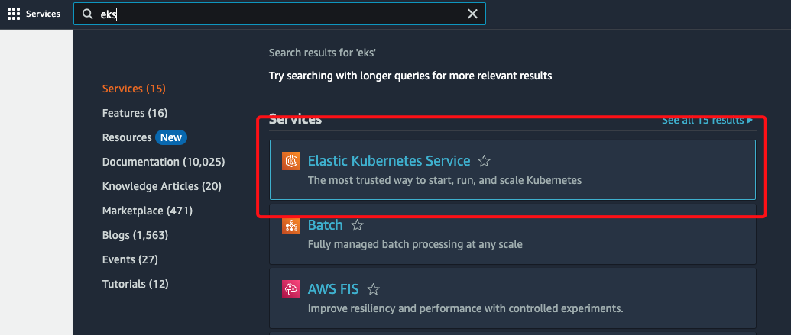

Ao clicar na página do serviço clique em <b>Add cluster</b>


Depois clique em create
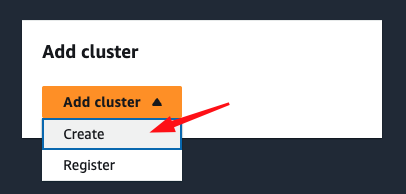

Ao clicar em create vamos preencher o nome do nosso cluster como `eks-lab` em <b>Nome</b>.
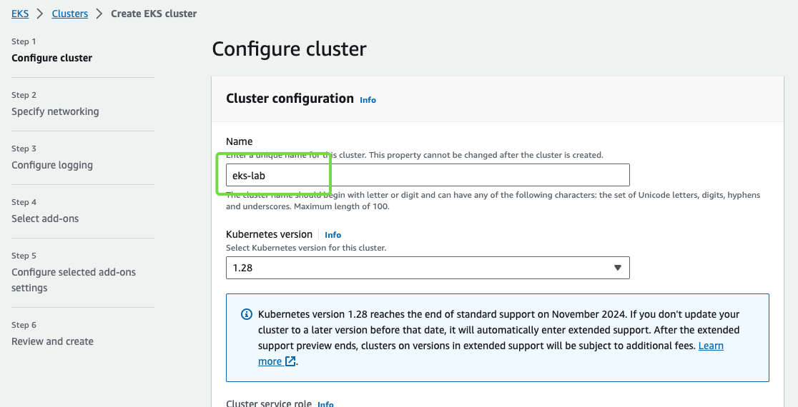

Logo em seguida clique em Next.
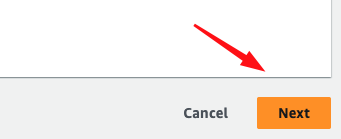

Em <b>Subnets</b> selecione as subnets `us-east-1a`, `us-east-1b` e `us-east-1c` e em <b>Security Groups</b> selecione o security group `default`.
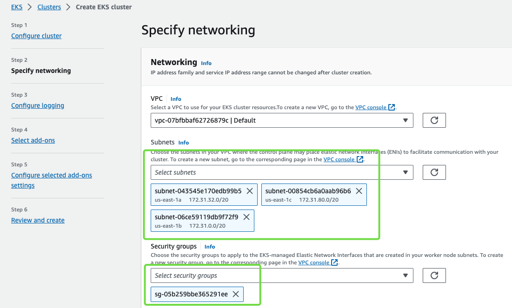

Clique em Next:
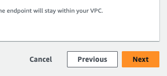

Nas configurações de log, em <b>Control plane logging</b> habilite os logs do `API Server`, `Audit`, `Authenticator`, `Controller Manager` e `Scheduler` e depois clique em <b>Next</b>.
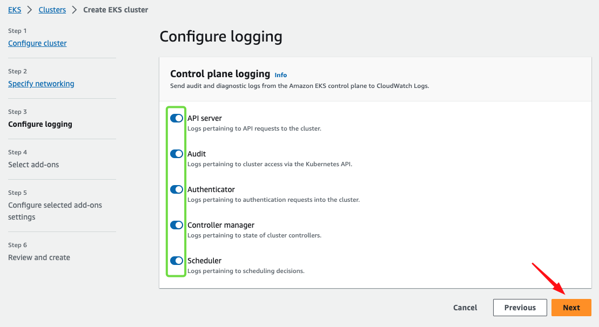

Em <b>add-ons</b> deixe selecionado o `CoreDNS`, `Amazon VPC CNI` e `kube-proxy`, logo em seguida clique em <b>Next</b>.
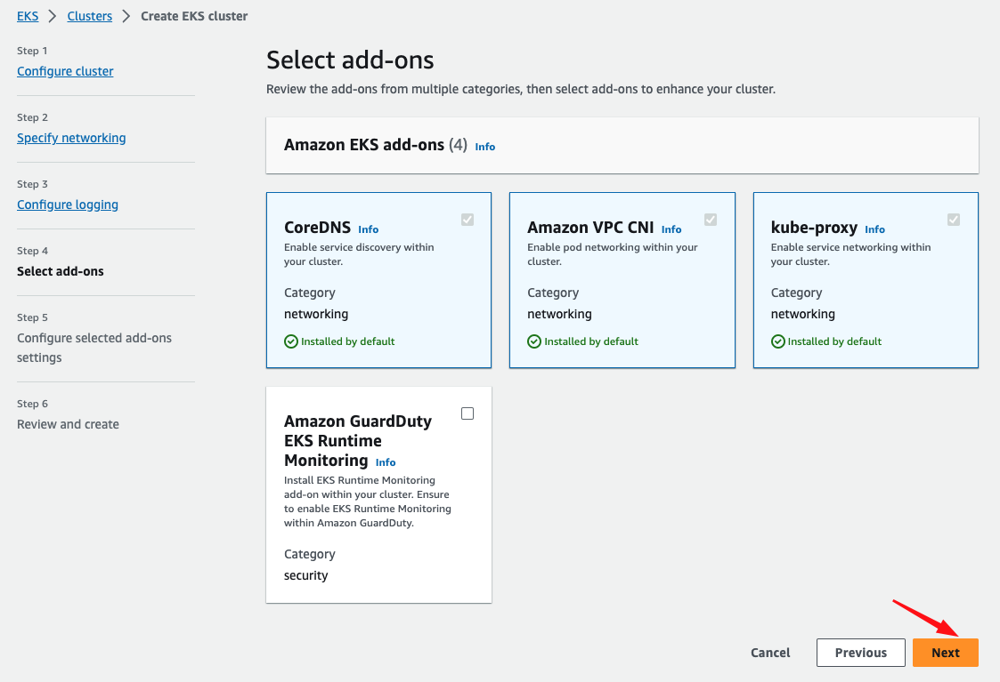

Clique em <b>Next</b>.
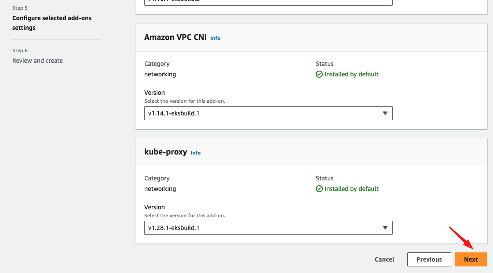

Clique em <b>Next</b> novamente para confirmar a instalação das versões dos plugins.
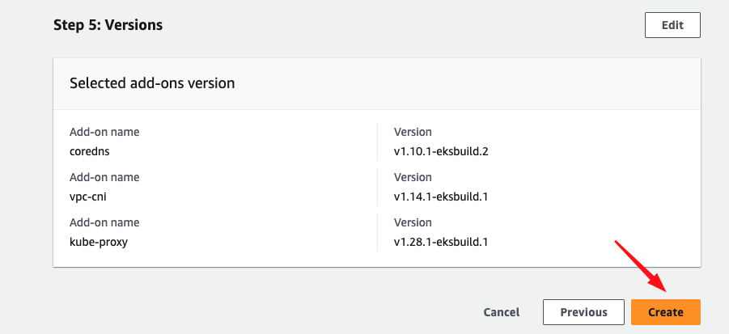

Aguarde a criação do cluster, demora em torno de 10 minutos.
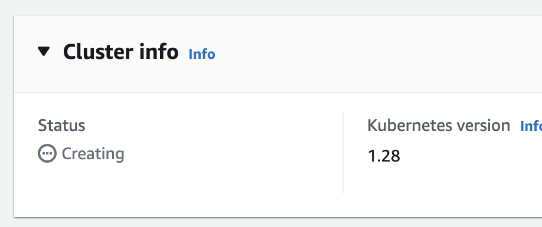

### Cloud Shell

Para gerenciar o nosso cluster, iremos utilizar o Cloud Shell serviço de Terminal Interativo da AWS.

Antes vamos entender o que é o Cloud Shell!

O AWS Cloud Shell é um ambiente de terminal interativo baseado no navegador que permite que você execute comandos e scripts da AWS CLI. Ele é pré-provisionado com as ferramentas e bibliotecas mais comuns que você precisa para trabalhar com a AWS, incluindo:

- Bash: O shell padrão do Linux
- Python: Uma linguagem de programação popular
- Node.js: Um ambiente de execução JavaScript
- Git: Um sistema de controle de versão

No concole da AWS, no canto inferior esquerdo, tem o ícone do Cloud Shell, clique nele!


Ao clicar no ícone do CloudShell ele irá provisionar um console para você poder utilizar para gerenciar os serviços da aws através de CLI (Command Line Interface).
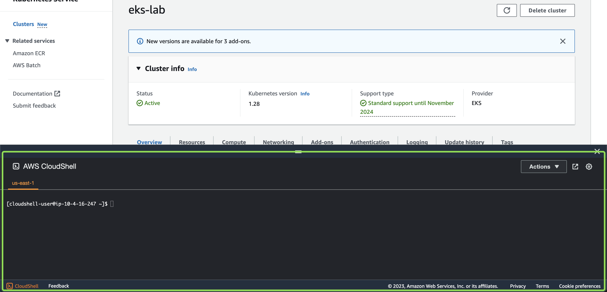

> O CloudShell é como se fosse aqueles consoles que existe em data centers, para quem não conhece:


Agora que conhece o CloudShell e para que ele serve, iremos utilizar ele até o final desta aula.

Nosso cluster já foi provisionado e agora precisamos gerenciar ele, lembra que eu comentei sobre o API Server que o cliente (kubectl) se conecta a ele para poder gerenciar o cluster, agora iremos configurar o kubectl, execute o comando abaixo no CloudShell:

```bash
aws eks update-kubeconfig --region us-east-1 --name eks-lab
```

### Pré-requisitos:

Verificando se os componentes do cluster está executando corretamente:

```
$ kubectl cluster-info

Kubernetes control plane is running at https://6FE18A9AFD90A9493632AEB363346F9E.gr7.us-east-1.eks.amazonaws.com
CoreDNS is running at https://6FE18A9AFD90A9493632AEB363346F9E.gr7.us-east-1.eks.amazonaws.com/api/v1/namespaces/kube-system/services/kube-dns:dns/proxy

To further debug and diagnose cluster problems, use 'kubectl cluster-info dump'.

```

Verificando se o Scheduler e o Controller-Manager está funcionando corretamente.

```
$ kubectl get componentstatuses
NAME                 STATUS    MESSAGE   ERROR
etcd-0               Healthy   ok
controller-manager   Healthy   ok
scheduler            Healthy   ok
```

Listando os nós do cluster:

```
$ kubectl get nodes
No resources found
```

O que está faltando provisionar?

### Provisionando os Nodes Groups
Ops, faltou provisionarmos o nosso <b>Node Group</b>, para provisionar, em cluster EKS clique em <b>Compute</b> e logo na sequência clique em <b>Add node group</b>.
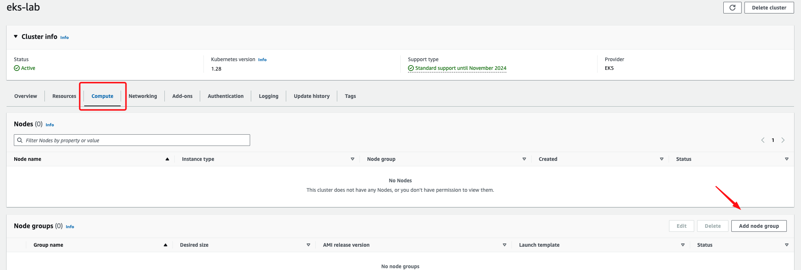

Listando os componentes do cluster

```
$ kubectl get all --all-namespaces
NAMESPACE     NAME                                          READY   STATUS    RESTARTS   AGE
kube-system   pod/coredns-597584b69b-6g8qb                  1/1     Running   0          2m33s
kube-system   pod/local-path-provisioner-79f67d76f8-8xgw8   1/1     Running   0          2m33s
kube-system   pod/metrics-server-5f9f776df5-vgr6j           1/1     Running   0          2m33s

NAMESPACE     NAME                     TYPE        CLUSTER-IP     EXTERNAL-IP   PORT(S)                  AGE
default       service/kubernetes       ClusterIP   10.43.0.1      <none>        443/TCP                  2m47s
kube-system   service/kube-dns         ClusterIP   10.43.0.10     <none>        53/UDP,53/TCP,9153/TCP   2m43s
kube-system   service/metrics-server   ClusterIP   10.43.240.11   <none>        443/TCP                  2m42s

NAMESPACE     NAME                                     READY   UP-TO-DATE   AVAILABLE   AGE
kube-system   deployment.apps/coredns                  1/1     1            1           2m43s
kube-system   deployment.apps/local-path-provisioner   1/1     1            1           2m43s
kube-system   deployment.apps/metrics-server           1/1     1            1           2m42s

NAMESPACE     NAME                                                DESIRED   CURRENT   READY   AGE
kube-system   replicaset.apps/coredns-597584b69b                  1         1         1       2m33s
kube-system   replicaset.apps/local-path-provisioner-79f67d76f8   1         1         1       2m33s
kube-system   replicaset.apps/metrics-server-5f9f776df5           1         1         1       2m33s
```

### Conhecendo o kubectl

O kubectl é uma ferramenta de linha de comando utilizada para interagir com clusters Kubernetes. Ele permite que os usuários gerenciem aplicativos e recursos em um cluster Kubernetes, como implantações, serviços, pods, configurações, etc.

Com o kubectl, é possível implantar e escalar aplicativos, fazer rolling updates e rollbacks, gerenciar o estado dos pods e serviços, criar e gerenciar objetos personalizados, além de muitas outras tarefas relacionadas ao gerenciamento de um cluster Kubernetes.

O kubectl é uma ferramenta essencial para qualquer pessoa que trabalhe com Kubernetes, como desenvolvedores, administradores de sistemas e operadores de cluster. Ele é usado em um ambiente de terminal para interagir com o cluster Kubernetes e executar operações em qualquer nó ou componente do cluster.

Em resumo, o kubectl é a principal ferramenta de gerenciamento de Kubernetes que permite que você controle e gerencie aplicativos em um cluster Kubernetes.

Obs: O k3d configura o contexto do cluster de forma automática, então iremos apenas listar os contextos já configurados.

Listando os contextos dos clusters configurados:

```
kubectl config get-contexts
CURRENT   NAME                                                   CLUSTER                                                    AUTHINFO                                                   NAMESPACE
          arn:aws:eks:us-east-1:223341017520:cluster/backend     arn:aws:eks:us-east-1:223341017520:cluster/backend         arn:aws:eks:us-east-1:223341017520:cluster/backend
          docker-desktop                                         docker-desktop                                             docker-desktop
*         k3d-hands-on                                           k3d-hands-on                                               admin@k3d-hands-on
```

O kubectl pode ser usado para configurar o contexto de um cluster no arquivo ~/.kube/config. Esse arquivo é usado pelo kubectl para determinar qual cluster, usuário e namespace devem ser usados para interagir com o cluster.

A seguir estão os principais elementos de um contexto configurado no arquivo ~/.kube/config:

`apiVersion`: a versão da API do Kubernetes usada pelo arquivo de configuração.\
`kind`: o tipo do objeto Kubernetes. Para um contexto, o tipo é Context.\
`name`: o nome do contexto.\
`context`: um objeto que define as informações de contexto para um cluster, incluindo cluster, user e namespace.\
`cluster`: um objeto que define as informações do cluster, incluindo o nome do cluster e o endpoint para se conectar ao API server.\
`user`: um objeto que define as informações de autenticação do usuário, como o nome do usuário e a chave de acesso.\
`namespace`: o namespace padrão a ser usado pelo contexto.\

Um exemplo de contexto configurado no arquivo ~/.kube/config pode ser semelhante a este:

```
apiVersion: v1
clusters:
- cluster:
    certificate-authority-data: LS0tLS1CRUdJTiBDRVJ....dEQkFtTlRudDBidHUwM2NpTDJFZUVxekdObWZoVE4KLS0tLS1FTkQgQ0VSVElGSUNBVEUtLS0tLQo=
    server: https://0.0.0.0:6443
  name: k3d-hands-on
contexts:
- context:
    cluster: k3d-hands-on
    user: admin@k3d-hands-on
  name: k3d-hands-on
current-context: k3d-hands-on
kind: Config
preferences: {}
users:
- name: admin@k3d-hands-on
  user:
    client-certificate-data: LS0tLS1CRUdJTiB...dEQkFtTlRudDBidHUwM2NpTDJFZUVxekdObWZoVE4KLS0tLS1FTkQgQ0VSVElGSUNBVEUtLS0tLQo==
    client-key-data: LS0tLS1CRUdJTiBFQyBQUklW...dEQkFtTlRudDBidHUwM2NpTDJFZUVxekdObWZoVE4KLS0tLS1FTkQgQ0VSVElGSUNBVEUtLS0tLQo=
```

### Realizando o deploy de uma aplicação

Agora que já entendemos os principais componentes do Cluster, iremos realizar o deploy de uma app, essa app será basicamente uma imagem do NGINX,  O NGINX é um servidor web de código aberto que pode ser usado para servir arquivos estáticos ou atuar como um proxy reverso para outros servidores web.


Na path /manifests, tem os manifestos para realizarmos o deploy.

Iremos utilizar primeiro o `deployment.yaml`, vamos entender os principais componentes deste manifesto.

`manifests/deployment.yaml`

```
apiVersion: apps/v1
kind: Deployment
metadata:
  name: nginx-deployment
  labels:
    app: nginx
spec:
  replicas: 2
  selector:
    matchLabels:
      app: nginx
  template:
    metadata:
      labels:
        app: nginx
    spec:
      containers:
      - name: nginx
        image: nginx:latest
        ports:
        - containerPort: 80
```

`apiVersion:` especifica a versão da API que está sendo utilizada, neste caso a apps/v1.\
`kind:` especifica o tipo de objeto que está sendo criado, neste caso um Deployment.\
`metadata:` contém informações de metadados do objeto, como o nome e labels para identificação.\
`replicas:` especifica o número de réplicas que serão criadas para garantir a disponibilidade da aplicação.\
`selector:` especifica o seletor de labels que será usado para identificar os Pods que fazem parte do Deployment.\
`template:` especifica o modelo para criação dos Pods do Deployment.\
`metadata:` contém as informações de metadados do Pod.\
`labels:` especifica as labels para identificação do Pod.\
`spec:` especifica as características do Pod, como os containers que serão executados dentro dele.\
`containers:` especifica o(s) container(s) que serão executados no Pod.\
`name:` especifica o nome do container.\
`image:` especifica a imagem do container que será utilizada.\
`ports:` especifica as portas que serão expostas pelo container. Neste caso, a porta 80 foi exposta.\

Após entender cada item do nosso manifesto, vamos utilizar ele para realizar o deploy do nosso app.

```
$ kubectl apply -f manifests/deployment.yaml
deployment.apps/nginx-deployment created
```

Após aplicado, iremos listar a nossa app.

```
$ kubectl get pods -l app=nginx
default       nginx-deployment-cd55c47f5-7sbgz          0/1     ContainerCreating   0          7s
default       nginx-deployment-cd55c47f5-c68ww          0/1     ContainerCreating   0          7s
```

Vamos realizar o get novamente para verificar se os `PODS` da app subiram.

```
$ kubectl get pods  -l app=nginx
NAME                               READY   STATUS    RESTARTS   AGE
nginx-deployment-cd55c47f5-c68ww   1/1     Running   0          67s
nginx-deployment-cd55c47f5-7sbgz   1/1     Running   0          67s
```

Trazendo informação mais detalhada dos pods.

```
kubectl get pods  -l app=nginx -o wide
NAME                                READY   STATUS    RESTARTS   AGE     IP          NODE                    NOMINATED NODE   READINESS GATES
nginx-deployment-5954ddfcc9-kl6pl   1/1     Running   0          2m14s   10.42.3.7   k3d-hands-on-server-0   <none>           <none>
nginx-deployment-5954ddfcc9-zchtl   1/1     Running   0          2m10s   10.42.0.7   k3d-hands-on-agent-1    <none>           <none>
```

Conhecendo o POD da nossa app, com o comando `kubectl describe pods <pod-name>`

```
$ kubectl describe pods nginx-deployment-cd55c47f5-c68ww

Name:             nginx-deployment-cd55c47f5-c68ww
Namespace:        default
Priority:         0
Service Account:  default
Node:             k3d-hands-on-agent-0/172.19.0.4
Start Time:       Thu, 16 Mar 2023 15:24:44 -0300
Labels:           app=nginx
                  pod-template-hash=cd55c47f5
Annotations:      <none>
Status:           Running
IP:               10.42.3.3
IPs:
  IP:           10.42.3.3
Controlled By:  ReplicaSet/nginx-deployment-cd55c47f5
Containers:
  nginx:
    Container ID:   containerd://397d8c86512c9c647e4579d42da4b26e12abcfd860bd484e46603b16ed1de585
    Image:          nginx:latest
    Image ID:       docker.io/library/nginx@sha256:aa0afebbb3cfa473099a62c4b32e9b3fb73ed23f2a75a65ce1d4b4f55a5c2ef2
    Port:           80/TCP
    Host Port:      0/TCP
    State:          Running
      Started:      Thu, 16 Mar 2023 15:24:55 -0300
    Ready:          True
    Restart Count:  0
    Environment:    <none>
    Mounts:
      /var/run/secrets/kubernetes.io/serviceaccount from kube-api-access-bqld7 (ro)
Conditions:
  Type              Status
  Initialized       True
  Ready             True
  ContainersReady   True
  PodScheduled      True
Volumes:
  kube-api-access-bqld7:
    Type:                    Projected (a volume that contains injected data from multiple sources)
    TokenExpirationSeconds:  3607
    ConfigMapName:           kube-root-ca.crt
    ConfigMapOptional:       <nil>
    DownwardAPI:             true
QoS Class:                   BestEffort
Node-Selectors:              <none>
Tolerations:                 node.kubernetes.io/not-ready:NoExecute op=Exists for 300s
                             node.kubernetes.io/unreachable:NoExecute op=Exists for 300s
Events:
  Type    Reason     Age   From               Message
  ----    ------     ----  ----               -------
  Normal  Scheduled  15m   default-scheduler  Successfully assigned default/nginx-deployment-cd55c47f5-c68ww to k3d-hands-on-agent-0
  Normal  Pulling    15m   kubelet            Pulling image "nginx:latest"
  Normal  Pulled     15m   kubelet            Successfully pulled image "nginx:latest" in 10.701844921s (10.701860672s including waiting)
  Normal  Created    15m   kubelet            Created container nginx
  Normal  Started    15m   kubelet            Started container nginx
```

Conhecendo o nosso deploy, utilizando o comando `kubectl describe deploy <deploy-name>`, mas antes iremos pegar o nome do nosso deploy\
Primeiro vamos realizar o `kubectl get deploy` para listar todos os deploys de todos os namespaces.\


```
$ kubectl get deploy
NAME               READY   UP-TO-DATE   AVAILABLE   AGE
nginx-deployment   2/2     2            2           20m
```

Descrevendo o deploy `nginx-deployment`.

```
$ kubectl describe deploy nginx-deployment

Name:                   nginx-deployment
Namespace:              default
CreationTimestamp:      Thu, 16 Mar 2023 15:24:44 -0300
Labels:                 app=nginx
Annotations:            deployment.kubernetes.io/revision: 1
Selector:               app=nginx
Replicas:               2 desired | 2 updated | 2 total | 2 available | 0 unavailable
StrategyType:           RollingUpdate
MinReadySeconds:        0
RollingUpdateStrategy:  25% max unavailable, 25% max surge
Pod Template:
  Labels:  app=nginx
  Containers:
   nginx:
    Image:        nginx:latest
    Port:         80/TCP
    Host Port:    0/TCP
    Environment:  <none>
    Mounts:       <none>
  Volumes:        <none>
Conditions:
  Type           Status  Reason
  ----           ------  ------
  Available      True    MinimumReplicasAvailable
  Progressing    True    NewReplicaSetAvailable
OldReplicaSets:  <none>
NewReplicaSet:   nginx-deployment-cd55c47f5 (2/2 replicas created)
Events:
  Type    Reason             Age   From                   Message
  ----    ------             ----  ----                   -------
  Normal  ScalingReplicaSet  22m   deployment-controller  Scaled up replica set nginx-deployment-cd55c47f5 to 2
```

### Acessando a App

Para acessar a app, precisamos expor o serviço em nosso cluster apontando para os nossos pods.

Criando a service para poder acessar a app, o manifesto está na path `manifests/service.yaml`.

O conteúdo do manifesto é:

`manifests/service.yaml`


```
apiVersion: v1
kind: Service
metadata:
  name: nginx-service
spec:
  type: LoadBalancer
  selector:
    app: nginx
  ports:
  - name: http
    port: 80
    targetPort: 80
````

Este manifesto descreve um serviço do Kubernetes com as seguintes configurações:

`apiVersion:` a versão da API do Kubernetes usada para criar o recurso. Neste caso, é a versão "v1".\
`kind:` o tipo do recurso Kubernetes que está sendo criado. Neste caso, é um "Service".\
`metadata:` informações sobre o objeto sendo criado, incluindo um nome descritivo e rótulos que permitem que o recurso seja pesquisado e gerenciado com facilidade.\
`spec:` as especificações do serviço, incluindo sua configuração de rede e informações de porta.\
`selector:` uma seleção baseada em rótulos que identifica os pods a serem expostos pelo serviço. Neste caso, o serviço expõe todos os pods com o rótulo "app: nginx".\
`type:` o tipo de serviço a ser criado. Neste caso, é um LoadBalancer, que permite fazer o balanceamento de carga entre os ips dos nós\
`ports:` as portas expostas pelo serviço. Neste caso, uma única porta é exposta com o nome "http" e mapeada para a porta 80 nos pods correspondentes à seleção de rótulo do serviço.

Após entender cada item do nosso manifesto, vamos utilizar ele para realizar o deploy da nossa service.

```
$ kubectl apply -f manifests/service.yaml
service/nginx-service created
```

Checando se a service foi criada com sucesso.
```
$ kubectl get service
NAME            TYPE           CLUSTER-IP      EXTERNAL-IP                                   PORT(S)        AGE
kubernetes      ClusterIP      10.43.0.1       <none>                                        443/TCP        18m
nginx-service   LoadBalancer   10.43.169.188   172.22.0.3,172.22.0.4,172.22.0.5,172.22.0.6   80:31258/TCP   8m16s
```

Repare que a nossa service `nginx-service` foi criada com sucesso.

Agora vamos acessar o app através do navegador, digite a url abaixo:

```
http://localhost:9080/
```


Sucesso! conseguimos acessar a nossa app.

### Escalando os PODs

Para escalar os pods iremos executar o comando `kubectl scale deployment`, atualmente temos 2 répicas e iremos aumentar para 8 réplicas.

```
kubectl scale deployment nginx-deployment --replicas=8
deployment.apps/nginx-deployment scaled
```

Checando se foi escalado corretamente.

```
$ kubectl get pods -l app=nginx
NAME                               READY   STATUS              RESTARTS   AGE
nginx-deployment-cd55c47f5-c68ww   1/1     Running             0          47m
nginx-deployment-cd55c47f5-7sbgz   1/1     Running             0          47m
nginx-deployment-cd55c47f5-nw5vn   0/1     ContainerCreating   0          3s
nginx-deployment-cd55c47f5-nbpgb   0/1     ContainerCreating   0          3s
nginx-deployment-cd55c47f5-l6mnv   0/1     ContainerCreating   0          3s
nginx-deployment-cd55c47f5-trrw9   0/1     ContainerCreating   0          3s
nginx-deployment-cd55c47f5-85rfb   0/1     ContainerCreating   0          3s
nginx-deployment-cd55c47f5-zhj67   1/1     Running             0          3s
```

Repare que os containers foram escalados para 8 réplicas.

```
NAME                               READY   STATUS    RESTARTS   AGE
nginx-deployment-cd55c47f5-c68ww   1/1     Running   0          48m
nginx-deployment-cd55c47f5-7sbgz   1/1     Running   0          48m
nginx-deployment-cd55c47f5-zhj67   1/1     Running   0          71s
nginx-deployment-cd55c47f5-l6mnv   1/1     Running   0          71s
nginx-deployment-cd55c47f5-nbpgb   1/1     Running   0          71s
nginx-deployment-cd55c47f5-nw5vn   1/1     Running   0          71s
nginx-deployment-cd55c47f5-trrw9   1/1     Running   0          71s
nginx-deployment-cd55c47f5-85rfb   1/1     Running   0          71s
```

Pronto os PODs foram escalados com sucesso!

Vamos voltar para duas réplicas.

```
kubectl scale deployment nginx-deployment --replicas=2
deployment.apps/nginx-deployment scaled
```

### Realizando rollback de versão

Para realizar o rollback da versão iremos aplicar o manifesto `manifests/deployment-v1.yaml`

```
$ kubectl apply -f manifests/deployment-v1.yaml
deployment.apps/nginx-deployment configured
```

Execute o curl para verificar se alterou a versão.

```
$ curl http://localhost:9080/
DEPLOYMENT VERSAO 1
```

Após realizar o deploy, vamos realizar o deploy do `manifests/deployment-v2.yaml`

```
$ kubectl apply -f manifests/deployment-v1.yaml
deployment.apps/nginx-deployment configured
```

Execute o curl para verificar se alterou a versão.

```
$ curl http://localhost:9080/
DEPLOYMENT VERSAO 2
```

Repare que os pods estão recém criados:
```
$ kubectl get pods -l app=nginx
NAME                                READY   STATUS    RESTARTS   AGE
nginx-deployment-75b69f9778-974lm   1/1     Running   0          42s
nginx-deployment-75b69f9778-jxsch   1/1     Running   0          40s
```

Realize o curl para retornar testar se estamos utilizar o curl.

```
$ curl http://localhost:9080/
DEPLOYMENT VERSAO 2
```

Agora iremos realizar o Rollback para a versão 1 do nosso deployment.
O Deployment cria uma revisão a cada alteração no deploy, para listar essas versões iremos utilizar o `kubectl rollout history`:

```
$ kubectl rollout history deploy nginx-deployment
deployment.apps/nginx-deployment
REVISION  CHANGE-CAUSE
1         <none>
2         <none>
3         <none>
```

Agora vamos realizar o rollback para a versão 2 da nossa app.

```
$ kubectl rollout undo deployment/nginx-deployment --to-revision=1
deployment.apps/nginx-deployment rolled back
```

### Coletado os logs dos pods.

Para coletar os logs dos PODs, iremos utilizar o `kubectl logs -f`

```
kubectl logs -f nginx-deployment-cd55c47f5-knjsg

/docker-entrypoint.sh: /docker-entrypoint.d/ is not empty, will attempt to perform configuration
/docker-entrypoint.sh: Looking for shell scripts in /docker-entrypoint.d/
/docker-entrypoint.sh: Launching /docker-entrypoint.d/10-listen-on-ipv6-by-default.sh
10-listen-on-ipv6-by-default.sh: info: Getting the checksum of /etc/nginx/conf.d/default.conf
10-listen-on-ipv6-by-default.sh: info: Enabled listen on IPv6 in /etc/nginx/conf.d/default.conf
/docker-entrypoint.sh: Launching /docker-entrypoint.d/20-envsubst-on-templates.sh
/docker-entrypoint.sh: Launching /docker-entrypoint.d/30-tune-worker-processes.sh
/docker-entrypoint.sh: Configuration complete; ready for start up
2023/03/16 20:26:42 [notice] 1#1: using the "epoll" event method
2023/03/16 20:26:42 [notice] 1#1: nginx/1.23.3
2023/03/16 20:26:42 [notice] 1#1: built by gcc 10.2.1 20210110 (Debian 10.2.1-6)
2023/03/16 20:26:42 [notice] 1#1: OS: Linux 5.15.49-linuxkit
2023/03/16 20:26:42 [notice] 1#1: getrlimit(RLIMIT_NOFILE): 1048576:1048576
2023/03/16 20:26:42 [notice] 1#1: start worker processes
2023/03/16 20:26:42 [notice] 1#1: start worker process 29
2023/03/16 20:26:42 [notice] 1#1: start worker process 30
2023/03/16 20:26:42 [notice] 1#1: start worker process 31
2023/03/16 20:26:42 [notice] 1#1: start worker process 32
2023/03/16 20:26:42 [notice] 1#1: start worker process 33

Logs dos GETS realizados

10.42.2.0 - - [16/Mar/2023:20:33:22 +0000] "GET / HTTP/1.1" 200 615 "-" "curl/7.86.0" "-"
10.42.2.0 - - [16/Mar/2023:20:33:55 +0000] "GET / HTTP/1.1" 200 615 "-" "curl/7.86.0" "-"
10.42.0.0 - - [16/Mar/2023:20:33:56 +0000] "GET / HTTP/1.1" 200 615 "-" "curl/7.86.0" "-"
```

### Executando comandos dentro do POD

Para executar comandos dentro dos pods, iremos utilizar o `kubectl exec -ti <pod> -- sh`

```
$ kubectl exec -ti nginx-deployment-5954ddfcc9-kl6pl -- sh
# curl localhost
DEPLOYMENT VERSAO 1
````

### Finalizando o Lab.

Agora é hora de limpar a casa! :)

Vamos deletar os objetos que criamos dentro do nosso cluster Kubernetes

Deletando a Service:

```
$ kubectl delete -f service.yaml
service "nginx-service" deleted
```

Deletendo o Deployment:

```
kubectl delete -f deployment-v1.yaml
deployment.apps "nginx-deployment" delete
```

E por último vamos deletar o nosso cluster.

```
k3d cluster delete hands-on
INFO[0000] Deleting cluster 'hands-on'
INFO[0001] Deleting cluster network 'k3d-hands-on'
INFO[0001] Deleting 1 attached volumes...
INFO[0001] Removing cluster details from default kubeconfig...
INFO[0001] Removing standalone kubeconfig file (if there is one)...
INFO[0001] Successfully deleted cluster hands-on!
```

### Conclusão
Parabéns, você concluiu com sucesso este laboratório de hands-on de Kubernetes!

Durante este laboratório, você aprendeu como criar um cluster Kubernetes usando o K3d e sobre os principais componentes que compõem um cluster Kubernetes. Você também aprendeu como criar um pod, deployment de uma aplicação, como escalar o ambiente, verificar os logs e até mesmo acessar um pod via SSH.

Este conhecimento é fundamental para quem deseja entender e trabalhar com Kubernetes, uma das plataformas mais utilizadas no mundo para orquestração de containers. Esperamos que este laboratório tenha sido útil para você e que agora você se sinta mais confiante para trabalhar com Kubernetes em seu ambiente. Parabéns novamente e continue praticando!